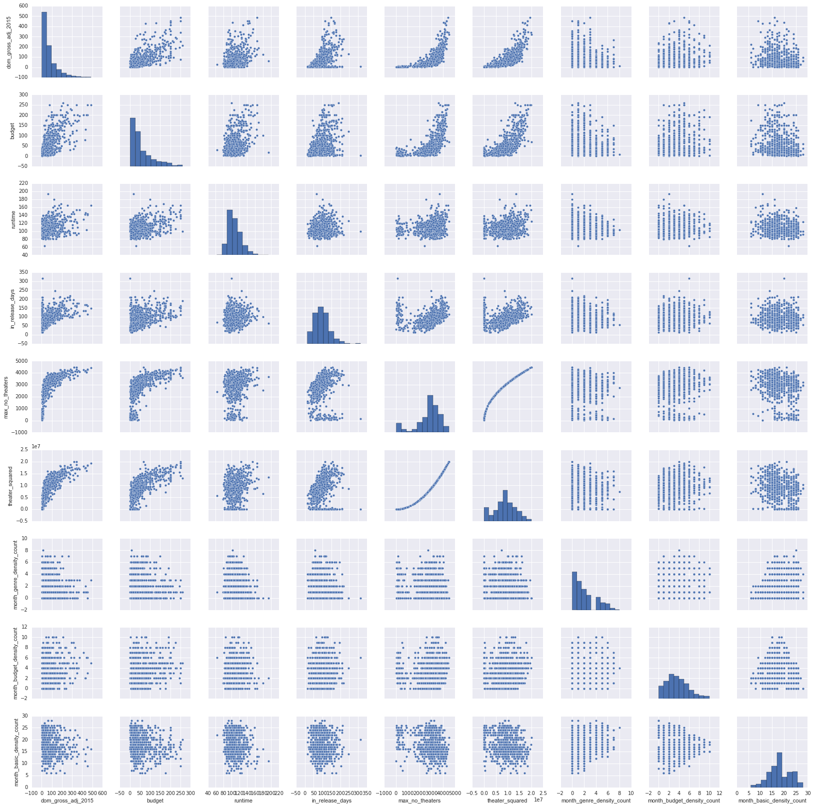
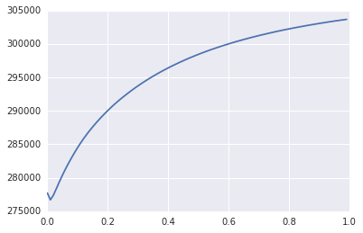

# 1.0 Getting movie links for scraping


```python
# Get Soup
import requests
from bs4 import BeautifulSoup
import re
import dateutil.parser

##Page list 
pagelist2015 = ['http://www.boxofficemojo.com/yearly/chart/?page=1&view=releasedate&view2=domestic&yr=2015&p=.htm','http://www.boxofficemojo.com/yearly/chart/?page=2&view=releasedate&view2=domestic&yr=2015&p=.htm','http://www.boxofficemojo.com/yearly/chart/?page=3&view=releasedate&view2=domestic&yr=2015&p=.htm','http://www.boxofficemojo.com/yearly/chart/?page=4&view=releasedate&view2=domestic&yr=2015&p=.htm','http://www.boxofficemojo.com/yearly/chart/?page=5&view=releasedate&view2=domestic&yr=2015&p=.htm','http://www.boxofficemojo.com/yearly/chart/?page=6&view=releasedate&view2=domestic&yr=2015&p=.htm','http://www.boxofficemojo.com/yearly/chart/?page=7&view=releasedate&view2=domestic&yr=2015&p=.htm']
pagelist2014 = ['http://www.boxofficemojo.com/yearly/chart/?yr=2014&adjust_yr=2015&p=.htm','http://www.boxofficemojo.com/yearly/chart/?page=2&view=releasedate&view2=domestic&yr=2014&adjust_mo=&adjust_yr=2015&p=.htm','http://www.boxofficemojo.com/yearly/chart/?page=3&view=releasedate&view2=domestic&yr=2014&adjust_mo=&adjust_yr=2015&p=.htm','http://www.boxofficemojo.com/yearly/chart/?page=4&view=releasedate&view2=domestic&yr=2014&adjust_mo=&adjust_yr=2015&p=.htm','http://www.boxofficemojo.com/yearly/chart/?page=5&view=releasedate&view2=domestic&yr=2014&adjust_mo=&adjust_yr=2015&p=.htm','http://www.boxofficemojo.com/yearly/chart/?page=6&view=releasedate&view2=domestic&yr=2014&adjust_mo=&adjust_yr=2015&p=.htm','http://www.boxofficemojo.com/yearly/chart/?page=7&view=releasedate&view2=domestic&yr=2014&adjust_mo=&adjust_yr=2015&p=.htm']
pagelist2013 = ['http://www.boxofficemojo.com/yearly/chart/?yr=2013&adjust_yr=2015&p=.htm','http://www.boxofficemojo.com/yearly/chart/?page=2&view=releasedate&view2=domestic&yr=2013&adjust_mo=&adjust_yr=2015&p=.htm','http://www.boxofficemojo.com/yearly/chart/?page=3&view=releasedate&view2=domestic&yr=2013&adjust_mo=&adjust_yr=2015&p=.htm','http://www.boxofficemojo.com/yearly/chart/?page=4&view=releasedate&view2=domestic&yr=2013&adjust_mo=&adjust_yr=2015&p=.htm','http://www.boxofficemojo.com/yearly/chart/?page=5&view=releasedate&view2=domestic&yr=2013&adjust_mo=&adjust_yr=2015&p=.htm','http://www.boxofficemojo.com/yearly/chart/?page=6&view=releasedate&view2=domestic&yr=2013&adjust_mo=&adjust_yr=2015&p=.htm','http://www.boxofficemojo.com/yearly/chart/?page=7&view=releasedate&view2=domestic&yr=2013&adjust_mo=&adjust_yr=2015&p=.htm']
pagelist2012 = ['http://www.boxofficemojo.com/yearly/chart/?yr=2012&adjust_yr=2015&p=.htm','http://www.boxofficemojo.com/yearly/chart/?page=2&view=releasedate&view2=domestic&yr=2012&adjust_mo=&adjust_yr=2015&p=.htm','http://www.boxofficemojo.com/yearly/chart/?page=3&view=releasedate&view2=domestic&yr=2012&adjust_mo=&adjust_yr=2015&p=.htm','http://www.boxofficemojo.com/yearly/chart/?page=4&view=releasedate&view2=domestic&yr=2012&adjust_mo=&adjust_yr=2015&p=.htm','http://www.boxofficemojo.com/yearly/chart/?page=5&view=releasedate&view2=domestic&yr=2012&adjust_mo=&adjust_yr=2015&p=.htm','http://www.boxofficemojo.com/yearly/chart/?page=6&view=releasedate&view2=domestic&yr=2012&adjust_mo=&adjust_yr=2015&p=.htm','http://www.boxofficemojo.com/yearly/chart/?page=7&view=releasedate&view2=domestic&yr=2012&adjust_mo=&adjust_yr=2015&p=.htm']
pagelist2011 = ['http://www.boxofficemojo.com/yearly/chart/?yr=2011&adjust_yr=2015&p=.htm','http://www.boxofficemojo.com/yearly/chart/?page=2&view=releasedate&view2=domestic&yr=2011&adjust_mo=&adjust_yr=2015&p=.htm','http://www.boxofficemojo.com/yearly/chart/?page=3&view=releasedate&view2=domestic&yr=2011&adjust_mo=&adjust_yr=2015&p=.htm','http://www.boxofficemojo.com/yearly/chart/?page=4&view=releasedate&view2=domestic&yr=2011&adjust_mo=&adjust_yr=2015&p=.htm','http://www.boxofficemojo.com/yearly/chart/?page=5&view=releasedate&view2=domestic&yr=2011&adjust_mo=&adjust_yr=2015&p=.htm','http://www.boxofficemojo.com/yearly/chart/?page=6&view=releasedate&view2=domestic&yr=2011&adjust_mo=&adjust_yr=2015&p=.htm','http://www.boxofficemojo.com/yearly/chart/?page=7&view=releasedate&view2=domestic&yr=2011&adjust_mo=&adjust_yr=2015&p=.htm']
pagelist = pagelist2015 + pagelist2014 + pagelist2013 + pagelist2012 + pagelist2011
```


```python
##Find movie links based on page list
movielist = []
for page in pagelist:
    url = page
    response = requests.get(url,headers={'Microsoft Edge':'Metis data science student scraping project'})
    soup = BeautifulSoup(response.text)
    for x in soup.find_all('a'):
        try:
            if "/movies/?id" in x['href']:
                movielist.append(x['href'])
            else:
                continue
        except:
            continue
            
##Translate movie links into full html addresses
htmllist = []
for x in movielist:
    htmllist.append('http://www.boxofficemojo.com'+x+'&adjust_yr=2015&p=.htm')
```

    C:\Users\kennd\Anaconda3\lib\site-packages\bs4\__init__.py:166: UserWarning: No parser was explicitly specified, so I'm using the best available HTML parser for this system ("lxml"). This usually isn't a problem, but if you run this code on another system, or in a different virtual environment, it may use a different parser and behave differently.
    
    To get rid of this warning, change this:
    
     BeautifulSoup([your markup])
    
    to this:
    
     BeautifulSoup([your markup], "lxml")
    
      markup_type=markup_type))
    


```python
len(htmllist)
```


    3388


# 2.0 Scraping Script


```python
## Import BeautifulSoup and scraping modules
from bs4 import BeautifulSoup
import requests
import re
url = 'http://www.boxofficemojo.com/movies/?id=fruitvale.htm'
response = requests.get(url,headers={'Microsoft Edge':'Metis data science student scraping project'})
soup = BeautifulSoup(response.text)
```

    C:\Users\kennd\Anaconda3\lib\site-packages\bs4\__init__.py:166: UserWarning: No parser was explicitly specified, so I'm using the best available HTML parser for this system ("lxml"). This usually isn't a problem, but if you run this code on another system, or in a different virtual environment, it may use a different parser and behave differently.
    
    To get rid of this warning, change this:
    
     BeautifulSoup([your markup])
    
    to this:
    
     BeautifulSoup([your markup], "lxml")
    
      markup_type=markup_type))
    

## 2.1 Subfunctions to extract data from movie webpages


```python
##Get movie title
def get_movie_title(soup):
    try:
        return soup.find('title').text.split('-')[0].split('(')[0].strip()
    except:
        return None

##Get movie domestic box office gross
def get_movie_domestic_gross(soup):
    try:
        return float(soup.find_all('b')[2].text.replace('$','').replace(',',''))/(10**6)
    except:
        return None
    
##Get movie distributor
def get_movie_distributor(soup):
    try:
        return soup.find(text=re.compile('Distributor')).findNextSibling().text.replace('/',' ').split()[0]
    except:
        return None
    
##Get movie release date
def get_movie_release_date(soup):
    try:
        datestring = soup.find(text=re.compile('Release Date')).findNextSibling().text
        date = dateutil.parser.parse(datestring)
        return date
    except:
        return None
        
##Get movie genre
def get_movie_genre(soup):
    try:
        return soup.find(text=re.compile('Genre:')).findNextSibling().text.split()[0]
    except:
        return None
    
##Get movie runtime
def get_movie_runtime(soup):
    try:
        runtime_string= soup.find(text=re.compile('Runtime')).findNextSibling().text.split()
        return float(runtime_string[0])*60 + float(runtime_string[2])
    except:
        return None

##Get movie MPAA rating
def get_movie_mpaa_rating(soup):
    try:
        return soup.find(text=re.compile('MPAA')).findNextSibling().text
    except:
        return None

##Get movie production budget
def get_movie_prod_budget(soup):
    try:
        prod_budget_string = soup.find(text=re.compile('Production Budget')).findNextSibling().text.replace('$','').replace(',','')
        if 'million' in prod_budget_string:
            return float(prod_budget_string.split()[0])
        else:
            return None
    except:
        return None

##Get movie opening weekend gross
def get_movie_weekend_gross(soup):
    if soup.find(text=re.compile('Wide\xa0Opening')):
        try:
            return float(soup.find(text=re.compile('Wide\xa0Opening')).findNext().text.replace('$','').replace(',',''))/(10**6)
        except:
            return None
    elif soup.find(text=re.compile('Opening\xa0Weekend')):
        try:
            return float(soup.find(text=re.compile('Opening\xa0Weekend')).findNext().text.replace('$','').replace(',',''))/(10**6)
        except:
            return None
    else:
        return None

##Get movie in release days
def get_movie_release_days(soup):
    try:
        return abs(float(soup.find(text=re.compile("In Release")).findNext().text.strip().split()[0]))
    except:
        return None
    

##Get movie widest # of theaters:
def get_movie_no_theaters(soup):
    try:
        return abs(float(soup.find(text=re.compile("Widest")).findNext().text.replace(',','').split()[0]))
    except:
        return None
```

## 2.2  Combine subfunctions into one function


```python
def get_movie_data(soup):
    datalist = []
    datalist.append(get_movie_title(soup))
    datalist.append(get_movie_domestic_gross(soup))
    datalist.append(get_movie_distributor(soup))
    datalist.append(get_movie_release_date(soup))
    datalist.append(get_movie_genre(soup))
    datalist.append(get_movie_runtime(soup))
    datalist.append(get_movie_mpaa_rating(soup))
    datalist.append(get_movie_prod_budget(soup))
    datalist.append(get_movie_weekend_gross(soup))
    datalist.append(get_movie_release_days(soup))
    datalist.append(get_movie_no_theaters(soup))
    df.append(datalist)
```

## 2.3 Loop through links and combine into one data frame


```python
##Set df as master list
df = []
for link in htmllist:
    response = requests.get(link,headers={'Microsoft Edge':'Metis data science student scraping project'})
    soup = BeautifulSoup(response.text)
    get_movie_data(soup)
```

    C:\Users\kennd\Anaconda3\lib\site-packages\bs4\__init__.py:166: UserWarning: No parser was explicitly specified, so I'm using the best available HTML parser for this system ("lxml"). This usually isn't a problem, but if you run this code on another system, or in a different virtual environment, it may use a different parser and behave differently.
    
    To get rid of this warning, change this:
    
     BeautifulSoup([your markup])
    
    to this:
    
     BeautifulSoup([your markup], "lxml")
    
      markup_type=markup_type))
    


```python
import pandas as pd
DF = pd.DataFrame(df, columns = ['title','dom_gross_adj_2015','distributor','release_date','genre','runtime','rating','budget','weekend_gross','in_release_days','max_no_theaters'])
DF.drop_duplicates()
DF.shape
```


    (3388, 11)


### Checkpoint 1: Pickle

##Pickle
import pickle
with open('my_data.pkl', 'wb') as picklefile:
    pickle.dump(DF, picklefile)


```python
##Take out of jar
import pickle
import pandas as pd
import numpy as np
import math
import matplotlib
import datetime
import calendar
%matplotlib inline
with open("my_data.pkl", 'rb') as picklefile: 
    DF = pickle.load(picklefile)
DF2 = DF.copy()
```


```python
def get_month(x):
    try:
        return calendar.month_name[x.month]
    except:
        return None
    
def get_weekday(x):
    return x.isoweekday()

def get_monthday(x):
    return x.day

def get_year(x):
    return x.year

DF2["release_month"] = DF2["release_date"].apply(get_month)
DF2["release_weekday"] = DF2["release_date"].apply(get_weekday)
DF2["release_monthday"] = DF2["release_date"].apply(get_monthday)
DF2["release_year"] = DF2["release_date"].apply(get_year)
```


```python
##Data filters this early to execute the rest of the script faster
DF2 = DF2[(DF2["release_year"] >= 2011) & (DF2["release_year"] < 2016)]
DF2 = DF2[DF2['genre'] != 'Foreign']
DF2 = DF2[DF2['dom_gross_adj_2015']<600]
DF2 = DF2.dropna()
DF2 = DF2[(DF2.dom_gross_adj_2015>1) & (DF2.budget>1)].reset_index(drop=True)
```


```python
##Create genre density count for each movie
##Very slow but no choice but to loop through the data frame
month_count_list = []
two_month_count_list = []
for current_row in range(DF2.shape[0]):
    month_count = 0.0
    two_month_count = 0.0
    current_DF = DF2.iloc[current_row,:]
    for compare_row in range(0,DF2.shape[0]):
        compare_DF = DF2.iloc[compare_row,:]
        try: 
            time_delta = abs((current_DF.release_date -compare_DF.release_date).days)
        except:
            time_delta = 100
        if time_delta <= 30 and (current_DF.genre == compare_DF.genre) and current_DF.title != compare_DF.title:
            month_count +=1
        if time_delta <= 60 and compare_DF.budget >= 100 and current_DF.title != compare_DF.title:
            two_month_count +=1
    month_count_list.append(month_count)
    two_month_count_list.append(two_month_count)
month_count_list = pd.Series(month_count_list)
two_month_count_list = pd.Series(two_month_count_list)
```


```python
##Create high budget density count for each movie
##Very slow but no choice but to loop through the data frame
budget_month_count_list = []
budget_two_month_count_list = []
for current_row in range(DF2.shape[0]):
    month_count = 0.0
    two_month_count = 0.0
    current_DF = DF2.iloc[current_row,:]
    for compare_row in range(0,DF2.shape[0]):
        compare_DF = DF2.iloc[compare_row,:]
        try: 
            time_delta = abs((current_DF.release_date - compare_DF.release_date).days)
        except:
            time_delta = 100  
        if time_delta <= 30 and compare_DF.budget >= 100 and current_DF.title != compare_DF.title:
            month_count +=1
        if time_delta <= 60 and compare_DF.budget >= 100 and current_DF.title != compare_DF.title:
            two_month_count +=1
    budget_month_count_list.append(month_count)
    budget_two_month_count_list.append(two_month_count)
budget_month_count_list = pd.Series(budget_month_count_list)
budget_two_month_count_list = pd.Series(budget_two_month_count_list)
```


```python
DF2["two_month_genre_density_count"] = two_month_count_list
DF2["month_genre_density_count"] = month_count_list
DF2["two_month_budget_density_count"] = budget_two_month_count_list
DF2["month_budget_density_count"] = budget_month_count_list
```

### Checkpoint 2: Pickle after creating density counts


```python
##Pickle checkpoint
import pickle
with open('my_data2.pkl', 'wb') as picklefile:
    pickle.dump(DF2, picklefile)
```


```python
with open("my_data2.pkl", 'rb') as picklefile: 
    DF2 = pickle.load(picklefile)
```

## Further data transformations


```python
DF2.release_month = DF2.release_month.astype('category')
DF2.release_weekday = DF2.release_weekday.astype('category')
DF2.release_monthday = DF2.release_monthday.astype('category')
DF2.release_year = DF2.release_year.astype('category')
DF2.distributor = DF2.distributor.astype('category')
DF2.genre = DF2.genre.astype('category')
DF2.rating = DF2.rating.astype('category')
```


```python
small_distributors = ['CBS','FilmDistrict','Summit','Roadside','Samuel','STX','Freestyle','Anchor','Well','High','Kenn','Newmarket','Oscilloscope','Picturehouse','Quaker','Rocky','A24']
def small_distributor(x):
    if x in small_distributors:
        return "Others"
    else:
        return x
```


```python
DF2['distributor'] = DF2['distributor'].apply(small_distributor)
```


```python
other_genres = ['Romantic','Romance','Musical','Sports','Adventure','Period','Western','Documentary','War','Concert','Music','Historical']
def other_genre(x):
    if x in other_genres:
        return "Others"
    else:
        return x
```


```python
DF2['genre'] = DF2['genre'].apply(other_genre)
```


```python
DF2['theater_squared'] = np.power(ENDF['max_no_theaters'],2)
```

### Checkpoint 3: Pickle after data transformations


```python
##Pickle checkpoint
import pickle
with open('my_data3.pkl', 'wb') as picklefile:
    pickle.dump(DF2, picklefile)
```


```python
import pickle
import pandas as pd
import numpy as np
import matplotlib.pyplot as plt
import seaborn as sns
import statsmodels.formula.api as smf
import statsmodels
%matplotlib inline
with open("my_data3.pkl", 'rb') as picklefile: 
    masterDF = pickle.load(picklefile)
```

# Turn in operational dataset to run regressions on


```python
##Create dummy variables for categorical variables
opDF = masterDF.copy()
genre_dummy = pd.get_dummies(opDF['genre'])
distributor_dummy = pd.get_dummies(opDF['distributor'])
month_dummy = pd.get_dummies(opDF['release_month'])

opDF = pd.concat([masterDF,genre_dummy,distributor_dummy,month_dummy],axis=1)
```


```python
##Delete non-essential variables
opDF = opDF.drop(['genre','distributor','release_month','Action','Buena','January','title','rating','release_date','release_weekday','release_monthday','release_year','weekend_gross'],axis=1)
```

# 3.0 Exploratory Analysis


```python
#Create copy just to be sure
DF3 = opDF.copy()
```

From the pairplots above, there's a strong non-linear relationship between budget and the maximum number of theaters. There's a risk of multicollinearity.


```python
pairDF = DF3[['dom_gross_adj_2015','budget','runtime','in_release_days','max_no_theaters','theater_squared','month_genre_density_count','month_budget_density_count']]
sns.pairplot(pairDF);
```





# 4.0 Regression Model


```python
##Separate OLS DataFrame
OLSDF = opDF.copy()
OLSDF = statsmodels.tools.tools.add_constant(OLSDF,prepend=False)
mask = np.random.random(OLSDF.shape[0])<0.8
OLSDF_train = OLSDF[mask]
OLSDF_test = OLSDF[~mask]
```


```python
OLSDF_train_Y = OLSDF_train.iloc[:,0]
OLSDF_train_X = OLSDF_train.iloc[:,1:]
```


```python
##Including everything to compare with elastic net
lm = smf.OLS(OLSDF_train_Y,OLSDF_train_X,hasconst=True)
fit = lm.fit()
fit.summary()
```


<table class="simpletable">
<caption>OLS Regression Results</caption>
<tr>
  <th>Dep. Variable:</th>    <td>dom_gross_adj_2015</td> <th>  R-squared:         </th> <td>   0.739</td>
</tr>
<tr>
  <th>Model:</th>                    <td>OLS</td>        <th>  Adj. R-squared:    </th> <td>   0.708</td>
</tr>
<tr>
  <th>Method:</th>              <td>Least Squares</td>   <th>  F-statistic:       </th> <td>   24.05</td>
</tr>
<tr>
  <th>Date:</th>              <td>Wed, 27 Apr 2016</td>  <th>  Prob (F-statistic):</th> <td>1.74e-78</td>
</tr>
<tr>
  <th>Time:</th>                  <td>19:40:29</td>      <th>  Log-Likelihood:    </th> <td> -1988.5</td>
</tr>
<tr>
  <th>No. Observations:</th>       <td>   391</td>       <th>  AIC:               </th> <td>   4061.</td>
</tr>
<tr>
  <th>Df Residuals:</th>           <td>   349</td>       <th>  BIC:               </th> <td>   4228.</td>
</tr>
<tr>
  <th>Df Model:</th>               <td>    41</td>       <th>                     </th>     <td> </td>   
</tr>
<tr>
  <th>Covariance Type:</th>       <td>nonrobust</td>     <th>                     </th>     <td> </td>   
</tr>
</table>
<table class="simpletable">
<tr>
                 <td></td>                   <th>coef</th>     <th>std err</th>      <th>t</th>      <th>P>|t|</th> <th>[95.0% Conf. Int.]</th> 
</tr>
<tr>
  <th>runtime</th>                        <td>    0.5261</td> <td>    0.170</td> <td>    3.094</td> <td> 0.002</td> <td>    0.192     0.861</td>
</tr>
<tr>
  <th>budget</th>                         <td>    0.2353</td> <td>    0.074</td> <td>    3.176</td> <td> 0.002</td> <td>    0.090     0.381</td>
</tr>
<tr>
  <th>in_release_days</th>                <td>    0.6450</td> <td>    0.078</td> <td>    8.254</td> <td> 0.000</td> <td>    0.491     0.799</td>
</tr>
<tr>
  <th>max_no_theaters</th>                <td>   -0.0369</td> <td>    0.011</td> <td>   -3.407</td> <td> 0.001</td> <td>   -0.058    -0.016</td>
</tr>
<tr>
  <th>two_month_genre_density_count</th>  <td>    0.2656</td> <td>    0.752</td> <td>    0.353</td> <td> 0.724</td> <td>   -1.214     1.745</td>
</tr>
<tr>
  <th>month_genre_density_count</th>      <td>   -0.5600</td> <td>    1.667</td> <td>   -0.336</td> <td> 0.737</td> <td>   -3.839     2.719</td>
</tr>
<tr>
  <th>two_month_budget_density_count</th> <td>    0.2656</td> <td>    0.752</td> <td>    0.353</td> <td> 0.724</td> <td>   -1.214     1.745</td>
</tr>
<tr>
  <th>month_budget_density_count</th>     <td>   -1.3090</td> <td>    2.515</td> <td>   -0.520</td> <td> 0.603</td> <td>   -6.256     3.638</td>
</tr>
<tr>
  <th>theater_squared</th>                <td> 1.604e-05</td> <td>  2.6e-06</td> <td>    6.178</td> <td> 0.000</td> <td> 1.09e-05  2.11e-05</td>
</tr>
<tr>
  <th>Animation</th>                      <td>  -22.1949</td> <td>   11.423</td> <td>   -1.943</td> <td> 0.053</td> <td>  -44.661     0.271</td>
</tr>
<tr>
  <th>Comedy</th>                         <td>   -1.2090</td> <td>    8.289</td> <td>   -0.146</td> <td> 0.884</td> <td>  -17.512    15.095</td>
</tr>
<tr>
  <th>Crime</th>                          <td>   -3.4750</td> <td>   16.868</td> <td>   -0.206</td> <td> 0.837</td> <td>  -36.651    29.701</td>
</tr>
<tr>
  <th>Drama</th>                          <td>   -6.0100</td> <td>    9.897</td> <td>   -0.607</td> <td> 0.544</td> <td>  -25.476    13.456</td>
</tr>
<tr>
  <th>Family</th>                         <td>  -31.7404</td> <td>   15.286</td> <td>   -2.076</td> <td> 0.039</td> <td>  -61.805    -1.675</td>
</tr>
<tr>
  <th>Fantasy</th>                        <td>  -25.0780</td> <td>   15.501</td> <td>   -1.618</td> <td> 0.107</td> <td>  -55.564     5.408</td>
</tr>
<tr>
  <th>Horror</th>                         <td>    3.0251</td> <td>   10.786</td> <td>    0.280</td> <td> 0.779</td> <td>  -18.188    24.238</td>
</tr>
<tr>
  <th>Others</th>                         <td>   -8.0820</td> <td>   10.345</td> <td>   -0.781</td> <td> 0.435</td> <td>  -28.428    12.264</td>
</tr>
<tr>
  <th>Sci-Fi</th>                         <td>  -26.5843</td> <td>    9.564</td> <td>   -2.780</td> <td> 0.006</td> <td>  -45.395    -7.773</td>
</tr>
<tr>
  <th>Thriller</th>                       <td>    2.5080</td> <td>   11.244</td> <td>    0.223</td> <td> 0.824</td> <td>  -19.606    24.622</td>
</tr>
<tr>
  <th>Focus</th>                          <td>   13.8359</td> <td>   16.317</td> <td>    0.848</td> <td> 0.397</td> <td>  -18.255    45.927</td>
</tr>
<tr>
  <th>Fox</th>                            <td>  -14.9883</td> <td>    9.944</td> <td>   -1.507</td> <td> 0.133</td> <td>  -34.547     4.570</td>
</tr>
<tr>
  <th>Lionsgate</th>                      <td>   24.3826</td> <td>   12.003</td> <td>    2.031</td> <td> 0.043</td> <td>    0.774    47.991</td>
</tr>
<tr>
  <th>Open</th>                           <td>   15.4106</td> <td>   16.531</td> <td>    0.932</td> <td> 0.352</td> <td>  -17.102    47.923</td>
</tr>
<tr>
  <th>Others</th>                         <td>   25.8441</td> <td>   12.389</td> <td>    2.086</td> <td> 0.038</td> <td>    1.478    50.210</td>
</tr>
<tr>
  <th>Paramount</th>                      <td>   27.1423</td> <td>   11.315</td> <td>    2.399</td> <td> 0.017</td> <td>    4.888    49.397</td>
</tr>
<tr>
  <th>Relativity</th>                     <td>   -1.4603</td> <td>   13.228</td> <td>   -0.110</td> <td> 0.912</td> <td>  -27.477    24.557</td>
</tr>
<tr>
  <th>Sony</th>                           <td>    8.5497</td> <td>   10.477</td> <td>    0.816</td> <td> 0.415</td> <td>  -12.057    29.156</td>
</tr>
<tr>
  <th>TriStar</th>                        <td>   31.5217</td> <td>   15.199</td> <td>    2.074</td> <td> 0.039</td> <td>    1.628    61.415</td>
</tr>
<tr>
  <th>Universal</th>                      <td>   36.8532</td> <td>   11.322</td> <td>    3.255</td> <td> 0.001</td> <td>   14.585    59.122</td>
</tr>
<tr>
  <th>Warner</th>                         <td>    0.5256</td> <td>   10.125</td> <td>    0.052</td> <td> 0.959</td> <td>  -19.389    20.440</td>
</tr>
<tr>
  <th>Weinstein</th>                      <td>   -4.1205</td> <td>   14.218</td> <td>   -0.290</td> <td> 0.772</td> <td>  -32.084    23.843</td>
</tr>
<tr>
  <th>April</th>                          <td>   -0.9410</td> <td>   12.193</td> <td>   -0.077</td> <td> 0.939</td> <td>  -24.922    23.040</td>
</tr>
<tr>
  <th>August</th>                         <td>    4.9357</td> <td>   11.488</td> <td>    0.430</td> <td> 0.668</td> <td>  -17.658    27.529</td>
</tr>
<tr>
  <th>December</th>                       <td>    4.2639</td> <td>   12.295</td> <td>    0.347</td> <td> 0.729</td> <td>  -19.917    28.445</td>
</tr>
<tr>
  <th>February</th>                       <td>    9.9814</td> <td>   11.027</td> <td>    0.905</td> <td> 0.366</td> <td>  -11.707    31.669</td>
</tr>
<tr>
  <th>July</th>                           <td>   15.2632</td> <td>   13.332</td> <td>    1.145</td> <td> 0.253</td> <td>  -10.958    41.484</td>
</tr>
<tr>
  <th>June</th>                           <td>   23.8450</td> <td>   14.290</td> <td>    1.669</td> <td> 0.096</td> <td>   -4.260    51.950</td>
</tr>
<tr>
  <th>March</th>                          <td>    9.7985</td> <td>   11.684</td> <td>    0.839</td> <td> 0.402</td> <td>  -13.182    32.779</td>
</tr>
<tr>
  <th>May</th>                            <td>   19.0269</td> <td>   14.333</td> <td>    1.328</td> <td> 0.185</td> <td>   -9.163    47.216</td>
</tr>
<tr>
  <th>November</th>                       <td>   22.5533</td> <td>   12.547</td> <td>    1.797</td> <td> 0.073</td> <td>   -2.125    47.231</td>
</tr>
<tr>
  <th>October</th>                        <td>    2.2886</td> <td>   11.100</td> <td>    0.206</td> <td> 0.837</td> <td>  -19.542    24.119</td>
</tr>
<tr>
  <th>September</th>                      <td>    1.0192</td> <td>   11.268</td> <td>    0.090</td> <td> 0.928</td> <td>  -21.143    23.181</td>
</tr>
<tr>
  <th>const</th>                          <td> -106.5693</td> <td>   26.099</td> <td>   -4.083</td> <td> 0.000</td> <td> -157.900   -55.238</td>
</tr>
</table>
<table class="simpletable">
<tr>
  <th>Omnibus:</th>       <td>101.268</td> <th>  Durbin-Watson:     </th> <td>   1.327</td>
</tr>
<tr>
  <th>Prob(Omnibus):</th> <td> 0.000</td>  <th>  Jarque-Bera (JB):  </th> <td> 311.737</td>
</tr>
<tr>
  <th>Skew:</th>          <td> 1.176</td>  <th>  Prob(JB):          </th> <td>2.03e-68</td>
</tr>
<tr>
  <th>Kurtosis:</th>      <td> 6.688</td>  <th>  Cond. No.          </th> <td>2.14e+16</td>
</tr>
</table>


```python
##Out of sample test
from sklearn.metrics import r2_score
OLSDF_test_X = OLSDF_test.iloc[:,1:]
OLSDF_test_Y = OLSDF_test.iloc[:,0]
y_pred = fit.predict(OLSDF_test_X)
y_actual = np.array(OLSDF_test_Y)
print("R-squared: ",r2_score(y_actual,y_pred))
print("Adj R-squared: ",1-(1-r2_score(y_actual,y_pred))*(OLSDF_test.shape[0]-1)/(OLSDF_test.shape[0]-OLSDF_test.shape[1]))
```

    R-squared:  0.762724320315
    Adj R-squared:  0.586813040548
    

# 5.0 Model Refinement

### 5.1 Elastic Net Variable Selection


```python
##Copy just to be sure
ENDF = opDF.copy()
ENDF = statsmodels.tools.tools.add_constant(ENDF,prepend=False)
```


```python
##Separate test and validation set 
mask = np.random.random(ENDF.shape[0]) < 0.8
ENDF_train = ENDF[mask]
ENDF_test = ENDF[~mask]
```


```python
##Cross validation on training set
from sklearn.cross_validation import KFold
from sklearn.linear_model import ElasticNet

ENDF_train_X = ENDF_train.iloc[:,1:]
ENDF_train_Y = ENDF_train.iloc[:,0]
x = np.array(ENDF_train_X)
y = np.array(ENDF_train_Y)

kf = KFold(x.shape[0], n_folds = 5)
alphalist = []
SSElist = []
for a in np.arange(0, 1, 0.01):
    SSE = 0
    alphalist.append(a)
    for train_index, test_index in kf:
        x_train, x_test = x[train_index], x[test_index]
        y_train, y_test = y[train_index], y[test_index]
        en = smf.OLS(y_train,x_train).fit_regularized(alpha=a,L1_wt=0.5,maxiter=1000)
        y_pred = en.predict(x_test)
        SSE += ((y_pred - y_test) **2).sum() #sum of squared errors
    SSE = SSE / 5
    SSElist.append(SSE)
```


```python
plt.plot(alphalist,SSElist)
```


    [<matplotlib.lines.Line2D at 0x15aceaf6cf8>]





```python
optimal_alpha = pd.DataFrame(SSElist,alphalist).sort_values(0).index[0]
```


```python
model = smf.OLS(ENDF_train_Y,ENDF_train_X).fit_regularized(alpha=optimal_alpha,L1_wt=0.5,maxiter=1000)
model.summary()
```


<table class="simpletable">
<caption>OLS Regression Results</caption>
<tr>
  <th>Dep. Variable:</th>    <td>dom_gross_adj_2015</td> <th>  R-squared:         </th> <td>   0.757</td>
</tr>
<tr>
  <th>Model:</th>                    <td>OLS</td>        <th>  Adj. R-squared:    </th> <td>   0.728</td>
</tr>
<tr>
  <th>Method:</th>              <td>Least Squares</td>   <th>  F-statistic:       </th> <td>   26.05</td>
</tr>
<tr>
  <th>Date:</th>              <td>Wed, 27 Apr 2016</td>  <th>  Prob (F-statistic):</th> <td>4.31e-82</td>
</tr>
<tr>
  <th>Time:</th>                  <td>19:46:50</td>      <th>  Log-Likelihood:    </th> <td> -1971.8</td>
</tr>
<tr>
  <th>No. Observations:</th>       <td>   385</td>       <th>  AIC:               </th> <td>   4028.</td>
</tr>
<tr>
  <th>Df Residuals:</th>           <td>   343</td>       <th>  BIC:               </th> <td>   4194.</td>
</tr>
<tr>
  <th>Df Model:</th>               <td>    41</td>       <th>                     </th>     <td> </td>   
</tr>
<tr>
  <th>Covariance Type:</th>       <td>nonrobust</td>     <th>                     </th>     <td> </td>   
</tr>
</table>
<table class="simpletable">
<tr>
                 <td></td>                   <th>coef</th>     <th>std err</th>      <th>t</th>      <th>P>|t|</th> <th>[95.0% Conf. Int.]</th> 
</tr>
<tr>
  <th>runtime</th>                        <td>    0.3576</td> <td>    0.177</td> <td>    2.015</td> <td> 0.045</td> <td>    0.009     0.707</td>
</tr>
<tr>
  <th>budget</th>                         <td>    0.2845</td> <td>    0.078</td> <td>    3.640</td> <td> 0.000</td> <td>    0.131     0.438</td>
</tr>
<tr>
  <th>in_release_days</th>                <td>    0.6451</td> <td>    0.082</td> <td>    7.878</td> <td> 0.000</td> <td>    0.484     0.806</td>
</tr>
<tr>
  <th>max_no_theaters</th>                <td>   -0.0622</td> <td>    0.011</td> <td>   -5.543</td> <td> 0.000</td> <td>   -0.084    -0.040</td>
</tr>
<tr>
  <th>two_month_genre_density_count</th>  <td>         0</td> <td>        0</td> <td>      nan</td> <td>   nan</td> <td>        0         0</td>
</tr>
<tr>
  <th>month_genre_density_count</th>      <td>   -0.9820</td> <td>    1.707</td> <td>   -0.575</td> <td> 0.565</td> <td>   -4.340     2.376</td>
</tr>
<tr>
  <th>two_month_budget_density_count</th> <td>         0</td> <td>        0</td> <td>      nan</td> <td>   nan</td> <td>        0         0</td>
</tr>
<tr>
  <th>month_budget_density_count</th>     <td>   -0.6228</td> <td>    1.565</td> <td>   -0.398</td> <td> 0.691</td> <td>   -3.702     2.456</td>
</tr>
<tr>
  <th>theater_squared</th>                <td> 2.056e-05</td> <td>  2.7e-06</td> <td>    7.625</td> <td> 0.000</td> <td> 1.53e-05  2.59e-05</td>
</tr>
<tr>
  <th>Animation</th>                      <td>  -20.2615</td> <td>   12.017</td> <td>   -1.686</td> <td> 0.093</td> <td>  -43.898     3.375</td>
</tr>
<tr>
  <th>Comedy</th>                         <td>    6.2895</td> <td>    8.581</td> <td>    0.733</td> <td> 0.464</td> <td>  -10.589    23.168</td>
</tr>
<tr>
  <th>Crime</th>                          <td>   -0.0858</td> <td>   18.612</td> <td>   -0.005</td> <td> 0.996</td> <td>  -36.694    36.522</td>
</tr>
<tr>
  <th>Drama</th>                          <td>   -6.2942</td> <td>   10.705</td> <td>   -0.588</td> <td> 0.557</td> <td>  -27.350    14.761</td>
</tr>
<tr>
  <th>Family</th>                         <td>  -18.2519</td> <td>   17.044</td> <td>   -1.071</td> <td> 0.285</td> <td>  -51.776    15.273</td>
</tr>
<tr>
  <th>Fantasy</th>                        <td>  -21.4573</td> <td>   17.710</td> <td>   -1.212</td> <td> 0.226</td> <td>  -56.291    13.376</td>
</tr>
<tr>
  <th>Horror</th>                         <td>    5.1277</td> <td>   11.393</td> <td>    0.450</td> <td> 0.653</td> <td>  -17.282    27.537</td>
</tr>
<tr>
  <th>Others</th>                         <td>   -5.2991</td> <td>   10.839</td> <td>   -0.489</td> <td> 0.625</td> <td>  -26.618    16.020</td>
</tr>
<tr>
  <th>Sci-Fi</th>                         <td>  -14.7628</td> <td>    9.873</td> <td>   -1.495</td> <td> 0.136</td> <td>  -34.182     4.657</td>
</tr>
<tr>
  <th>Thriller</th>                       <td>    6.3893</td> <td>   11.956</td> <td>    0.534</td> <td> 0.593</td> <td>  -17.127    29.906</td>
</tr>
<tr>
  <th>Focus</th>                          <td>   -5.9219</td> <td>   17.041</td> <td>   -0.348</td> <td> 0.728</td> <td>  -39.440    27.597</td>
</tr>
<tr>
  <th>Fox</th>                            <td>  -27.8110</td> <td>   10.133</td> <td>   -2.745</td> <td> 0.006</td> <td>  -47.742    -7.880</td>
</tr>
<tr>
  <th>Lionsgate</th>                      <td>    9.3532</td> <td>   12.196</td> <td>    0.767</td> <td> 0.444</td> <td>  -14.635    33.342</td>
</tr>
<tr>
  <th>Open</th>                           <td>    0.5445</td> <td>   17.582</td> <td>    0.031</td> <td> 0.975</td> <td>  -34.037    35.126</td>
</tr>
<tr>
  <th>Others</th>                         <td>   -0.4858</td> <td>   12.351</td> <td>   -0.039</td> <td> 0.969</td> <td>  -24.779    23.808</td>
</tr>
<tr>
  <th>Paramount</th>                      <td>    4.6433</td> <td>   11.112</td> <td>    0.418</td> <td> 0.676</td> <td>  -17.213    26.500</td>
</tr>
<tr>
  <th>Relativity</th>                     <td>  -13.5255</td> <td>   13.996</td> <td>   -0.966</td> <td> 0.335</td> <td>  -41.054    14.003</td>
</tr>
<tr>
  <th>Sony</th>                           <td>   -5.9744</td> <td>   10.518</td> <td>   -0.568</td> <td> 0.570</td> <td>  -26.662    14.713</td>
</tr>
<tr>
  <th>TriStar</th>                        <td>    8.2809</td> <td>   15.575</td> <td>    0.532</td> <td> 0.595</td> <td>  -22.354    38.916</td>
</tr>
<tr>
  <th>Universal</th>                      <td>   17.6604</td> <td>   11.826</td> <td>    1.493</td> <td> 0.136</td> <td>   -5.601    40.922</td>
</tr>
<tr>
  <th>Warner</th>                         <td>  -13.2671</td> <td>   10.252</td> <td>   -1.294</td> <td> 0.196</td> <td>  -33.431     6.897</td>
</tr>
<tr>
  <th>Weinstein</th>                      <td>  -17.1043</td> <td>   14.766</td> <td>   -1.158</td> <td> 0.248</td> <td>  -46.148    11.939</td>
</tr>
<tr>
  <th>April</th>                          <td>  -11.9344</td> <td>   12.730</td> <td>   -0.938</td> <td> 0.349</td> <td>  -36.973    13.104</td>
</tr>
<tr>
  <th>August</th>                         <td>   -3.3872</td> <td>   12.040</td> <td>   -0.281</td> <td> 0.779</td> <td>  -27.069    20.295</td>
</tr>
<tr>
  <th>December</th>                       <td>   -0.7546</td> <td>   13.560</td> <td>   -0.056</td> <td> 0.956</td> <td>  -27.425    25.916</td>
</tr>
<tr>
  <th>February</th>                       <td>    2.0242</td> <td>   12.505</td> <td>    0.162</td> <td> 0.872</td> <td>  -22.572    26.620</td>
</tr>
<tr>
  <th>July</th>                           <td>   -4.7562</td> <td>   14.451</td> <td>   -0.329</td> <td> 0.742</td> <td>  -33.180    23.668</td>
</tr>
<tr>
  <th>June</th>                           <td>   10.8100</td> <td>   15.393</td> <td>    0.702</td> <td> 0.483</td> <td>  -19.466    41.086</td>
</tr>
<tr>
  <th>March</th>                          <td>   -2.2810</td> <td>   13.146</td> <td>   -0.174</td> <td> 0.862</td> <td>  -28.139    23.577</td>
</tr>
<tr>
  <th>May</th>                            <td>    5.3548</td> <td>   15.423</td> <td>    0.347</td> <td> 0.729</td> <td>  -24.980    35.690</td>
</tr>
<tr>
  <th>November</th>                       <td>    2.0927</td> <td>   13.234</td> <td>    0.158</td> <td> 0.874</td> <td>  -23.937    28.123</td>
</tr>
<tr>
  <th>October</th>                        <td>   -5.7960</td> <td>   11.983</td> <td>   -0.484</td> <td> 0.629</td> <td>  -29.365    17.773</td>
</tr>
<tr>
  <th>September</th>                      <td>   -8.6155</td> <td>   12.139</td> <td>   -0.710</td> <td> 0.478</td> <td>  -32.491    15.260</td>
</tr>
<tr>
  <th>const</th>                          <td>  -32.0090</td> <td>   26.419</td> <td>   -1.212</td> <td> 0.226</td> <td>  -83.972    19.954</td>
</tr>
</table>
<table class="simpletable">
<tr>
  <th>Omnibus:</th>       <td>84.425</td> <th>  Durbin-Watson:     </th> <td>   1.313</td>
</tr>
<tr>
  <th>Prob(Omnibus):</th> <td> 0.000</td> <th>  Jarque-Bera (JB):  </th> <td> 243.894</td>
</tr>
<tr>
  <th>Skew:</th>          <td> 1.013</td> <th>  Prob(JB):          </th> <td>1.09e-53</td>
</tr>
<tr>
  <th>Kurtosis:</th>      <td> 6.332</td> <th>  Cond. No.          </th> <td>     nan</td>
</tr>
</table>


```python
##Test set Adj. RSquare
ENDF_test_X = ENDF_test.iloc[:,1:]
ENDF_test_Y = ENDF_test.iloc[:,0]
x_test = np.array(ENDF_test_X)
y_test = np.array(ENDF_test_Y)
y_pred = model.predict(x_test)
y_actual = np.array(y_test)
print("R-squared: ",r2_score(y_actual,y_pred))
print("Adj. R-squared: ",1-(1-r2_score(y_actual,y_pred))*(ENDF_test_X.shape[0]-1)/(ENDF_test_X.shape[0]-ENDF_test_X.shape[1]))
```

    R-squared:  0.619770740915
    Adj. R-squared:  0.374084142738
    

# 6.0 OLS with EN Variable Selection


```python
##Separate OLS DataFrame
OLSDF2 = opDF.copy()

##Exclude variables with zero coefficient
OLSDF2 = OLSDF2.drop(['two_month_budget_density_count','two_month_genre_density_count'],axis=1)
OLSDF2 = statsmodels.tools.tools.add_constant(OLSDF2,prepend=False)
mask = np.random.random(OLSDF2.shape[0])<0.8
OLSDF2_train = OLSDF2[mask]
OLSDF2_test = OLSDF2[~mask]
```


```python
OLSDF2_train_Y = OLSDF2_train.iloc[:,0]
OLSDF2_train_X = OLSDF2_train.iloc[:,1:]
```


```python
##Including everything to compare with elastic net
lm = smf.OLS(OLSDF2_train_Y,OLSDF2_train_X,hasconst=True)
fit = lm.fit()
fit.summary()
```


<table class="simpletable">
<caption>OLS Regression Results</caption>
<tr>
  <th>Dep. Variable:</th>    <td>dom_gross_adj_2015</td> <th>  R-squared:         </th> <td>   0.755</td>
</tr>
<tr>
  <th>Model:</th>                    <td>OLS</td>        <th>  Adj. R-squared:    </th> <td>   0.728</td>
</tr>
<tr>
  <th>Method:</th>              <td>Least Squares</td>   <th>  F-statistic:       </th> <td>   27.41</td>
</tr>
<tr>
  <th>Date:</th>              <td>Wed, 27 Apr 2016</td>  <th>  Prob (F-statistic):</th> <td>1.77e-85</td>
</tr>
<tr>
  <th>Time:</th>                  <td>19:49:40</td>      <th>  Log-Likelihood:    </th> <td> -2018.3</td>
</tr>
<tr>
  <th>No. Observations:</th>       <td>   396</td>       <th>  AIC:               </th> <td>   4119.</td>
</tr>
<tr>
  <th>Df Residuals:</th>           <td>   355</td>       <th>  BIC:               </th> <td>   4282.</td>
</tr>
<tr>
  <th>Df Model:</th>               <td>    40</td>       <th>                     </th>     <td> </td>   
</tr>
<tr>
  <th>Covariance Type:</th>       <td>nonrobust</td>     <th>                     </th>     <td> </td>   
</tr>
</table>
<table class="simpletable">
<tr>
               <td></td>                 <th>coef</th>     <th>std err</th>      <th>t</th>      <th>P>|t|</th> <th>[95.0% Conf. Int.]</th> 
</tr>
<tr>
  <th>runtime</th>                    <td>    0.4485</td> <td>    0.170</td> <td>    2.637</td> <td> 0.009</td> <td>    0.114     0.783</td>
</tr>
<tr>
  <th>budget</th>                     <td>    0.1800</td> <td>    0.076</td> <td>    2.355</td> <td> 0.019</td> <td>    0.030     0.330</td>
</tr>
<tr>
  <th>in_release_days</th>            <td>    0.6202</td> <td>    0.080</td> <td>    7.756</td> <td> 0.000</td> <td>    0.463     0.777</td>
</tr>
<tr>
  <th>max_no_theaters</th>            <td>   -0.0440</td> <td>    0.011</td> <td>   -4.053</td> <td> 0.000</td> <td>   -0.065    -0.023</td>
</tr>
<tr>
  <th>month_genre_density_count</th>  <td>   -2.2981</td> <td>    1.664</td> <td>   -1.381</td> <td> 0.168</td> <td>   -5.570     0.974</td>
</tr>
<tr>
  <th>month_budget_density_count</th> <td>    0.3823</td> <td>    1.511</td> <td>    0.253</td> <td> 0.800</td> <td>   -2.589     3.354</td>
</tr>
<tr>
  <th>theater_squared</th>            <td> 1.847e-05</td> <td> 2.69e-06</td> <td>    6.868</td> <td> 0.000</td> <td> 1.32e-05  2.38e-05</td>
</tr>
<tr>
  <th>Animation</th>                  <td>  -32.8430</td> <td>   11.570</td> <td>   -2.839</td> <td> 0.005</td> <td>  -55.597   -10.089</td>
</tr>
<tr>
  <th>Comedy</th>                     <td>   -4.2563</td> <td>    8.076</td> <td>   -0.527</td> <td> 0.599</td> <td>  -20.139    11.627</td>
</tr>
<tr>
  <th>Crime</th>                      <td>  -11.1279</td> <td>   15.326</td> <td>   -0.726</td> <td> 0.468</td> <td>  -41.270    19.014</td>
</tr>
<tr>
  <th>Drama</th>                      <td>  -12.6883</td> <td>    9.632</td> <td>   -1.317</td> <td> 0.189</td> <td>  -31.632     6.255</td>
</tr>
<tr>
  <th>Family</th>                     <td>  -43.1488</td> <td>   19.782</td> <td>   -2.181</td> <td> 0.030</td> <td>  -82.053    -4.245</td>
</tr>
<tr>
  <th>Fantasy</th>                    <td>  -36.5152</td> <td>   16.154</td> <td>   -2.260</td> <td> 0.024</td> <td>  -68.285    -4.746</td>
</tr>
<tr>
  <th>Horror</th>                     <td>   -3.7626</td> <td>   10.769</td> <td>   -0.349</td> <td> 0.727</td> <td>  -24.942    17.417</td>
</tr>
<tr>
  <th>Others</th>                     <td>  -12.4114</td> <td>   10.010</td> <td>   -1.240</td> <td> 0.216</td> <td>  -32.097     7.274</td>
</tr>
<tr>
  <th>Sci-Fi</th>                     <td>  -32.1094</td> <td>    9.519</td> <td>   -3.373</td> <td> 0.001</td> <td>  -50.829   -13.390</td>
</tr>
<tr>
  <th>Thriller</th>                   <td>   -1.3007</td> <td>   10.947</td> <td>   -0.119</td> <td> 0.905</td> <td>  -22.829    20.228</td>
</tr>
<tr>
  <th>Focus</th>                      <td>   -1.3505</td> <td>   15.273</td> <td>   -0.088</td> <td> 0.930</td> <td>  -31.387    28.686</td>
</tr>
<tr>
  <th>Fox</th>                        <td>  -28.8345</td> <td>   10.104</td> <td>   -2.854</td> <td> 0.005</td> <td>  -48.705    -8.964</td>
</tr>
<tr>
  <th>Lionsgate</th>                  <td>    4.4057</td> <td>   11.555</td> <td>    0.381</td> <td> 0.703</td> <td>  -18.320    27.131</td>
</tr>
<tr>
  <th>Open</th>                       <td>   -2.7226</td> <td>   14.699</td> <td>   -0.185</td> <td> 0.853</td> <td>  -31.630    26.185</td>
</tr>
<tr>
  <th>Others</th>                     <td>   11.9456</td> <td>   12.182</td> <td>    0.981</td> <td> 0.327</td> <td>  -12.012    35.904</td>
</tr>
<tr>
  <th>Paramount</th>                  <td>    5.1918</td> <td>   11.008</td> <td>    0.472</td> <td> 0.637</td> <td>  -16.457    26.841</td>
</tr>
<tr>
  <th>Relativity</th>                 <td>  -21.0111</td> <td>   14.256</td> <td>   -1.474</td> <td> 0.141</td> <td>  -49.048     7.026</td>
</tr>
<tr>
  <th>Sony</th>                       <td>   -7.9320</td> <td>   10.131</td> <td>   -0.783</td> <td> 0.434</td> <td>  -27.857    11.993</td>
</tr>
<tr>
  <th>TriStar</th>                    <td>   14.3004</td> <td>   15.254</td> <td>    0.937</td> <td> 0.349</td> <td>  -15.699    44.300</td>
</tr>
<tr>
  <th>Universal</th>                  <td>   14.0482</td> <td>   11.334</td> <td>    1.239</td> <td> 0.216</td> <td>   -8.242    36.338</td>
</tr>
<tr>
  <th>Warner</th>                     <td>  -18.5159</td> <td>   10.118</td> <td>   -1.830</td> <td> 0.068</td> <td>  -38.415     1.383</td>
</tr>
<tr>
  <th>Weinstein</th>                  <td>  -17.3519</td> <td>   14.139</td> <td>   -1.227</td> <td> 0.221</td> <td>  -45.159    10.455</td>
</tr>
<tr>
  <th>April</th>                      <td>   -6.0619</td> <td>   12.113</td> <td>   -0.500</td> <td> 0.617</td> <td>  -29.884    17.760</td>
</tr>
<tr>
  <th>August</th>                     <td>    4.1239</td> <td>   11.201</td> <td>    0.368</td> <td> 0.713</td> <td>  -17.905    26.153</td>
</tr>
<tr>
  <th>December</th>                   <td>    8.9666</td> <td>   12.349</td> <td>    0.726</td> <td> 0.468</td> <td>  -15.320    33.253</td>
</tr>
<tr>
  <th>February</th>                   <td>    9.7389</td> <td>   11.580</td> <td>    0.841</td> <td> 0.401</td> <td>  -13.036    32.514</td>
</tr>
<tr>
  <th>July</th>                       <td>    7.0035</td> <td>   13.495</td> <td>    0.519</td> <td> 0.604</td> <td>  -19.537    33.544</td>
</tr>
<tr>
  <th>June</th>                       <td>   24.9040</td> <td>   14.354</td> <td>    1.735</td> <td> 0.084</td> <td>   -3.326    53.134</td>
</tr>
<tr>
  <th>March</th>                      <td>    2.6098</td> <td>   11.740</td> <td>    0.222</td> <td> 0.824</td> <td>  -20.479    25.699</td>
</tr>
<tr>
  <th>May</th>                        <td>   14.7043</td> <td>   14.392</td> <td>    1.022</td> <td> 0.308</td> <td>  -13.600    43.009</td>
</tr>
<tr>
  <th>November</th>                   <td>    9.3441</td> <td>   12.340</td> <td>    0.757</td> <td> 0.449</td> <td>  -14.925    33.613</td>
</tr>
<tr>
  <th>October</th>                    <td>   -2.2278</td> <td>   11.220</td> <td>   -0.199</td> <td> 0.843</td> <td>  -24.294    19.838</td>
</tr>
<tr>
  <th>September</th>                  <td>    4.1612</td> <td>   11.176</td> <td>    0.372</td> <td> 0.710</td> <td>  -17.818    26.141</td>
</tr>
<tr>
  <th>const</th>                      <td>  -68.4636</td> <td>   26.147</td> <td>   -2.618</td> <td> 0.009</td> <td> -119.886   -17.041</td>
</tr>
</table>
<table class="simpletable">
<tr>
  <th>Omnibus:</th>       <td>82.312</td> <th>  Durbin-Watson:     </th> <td>   1.374</td>
</tr>
<tr>
  <th>Prob(Omnibus):</th> <td> 0.000</td> <th>  Jarque-Bera (JB):  </th> <td> 240.569</td>
</tr>
<tr>
  <th>Skew:</th>          <td> 0.959</td> <th>  Prob(JB):          </th> <td>5.77e-53</td>
</tr>
<tr>
  <th>Kurtosis:</th>      <td> 6.302</td> <th>  Cond. No.          </th> <td>1.75e+08</td>
</tr>
</table>


```python

```
