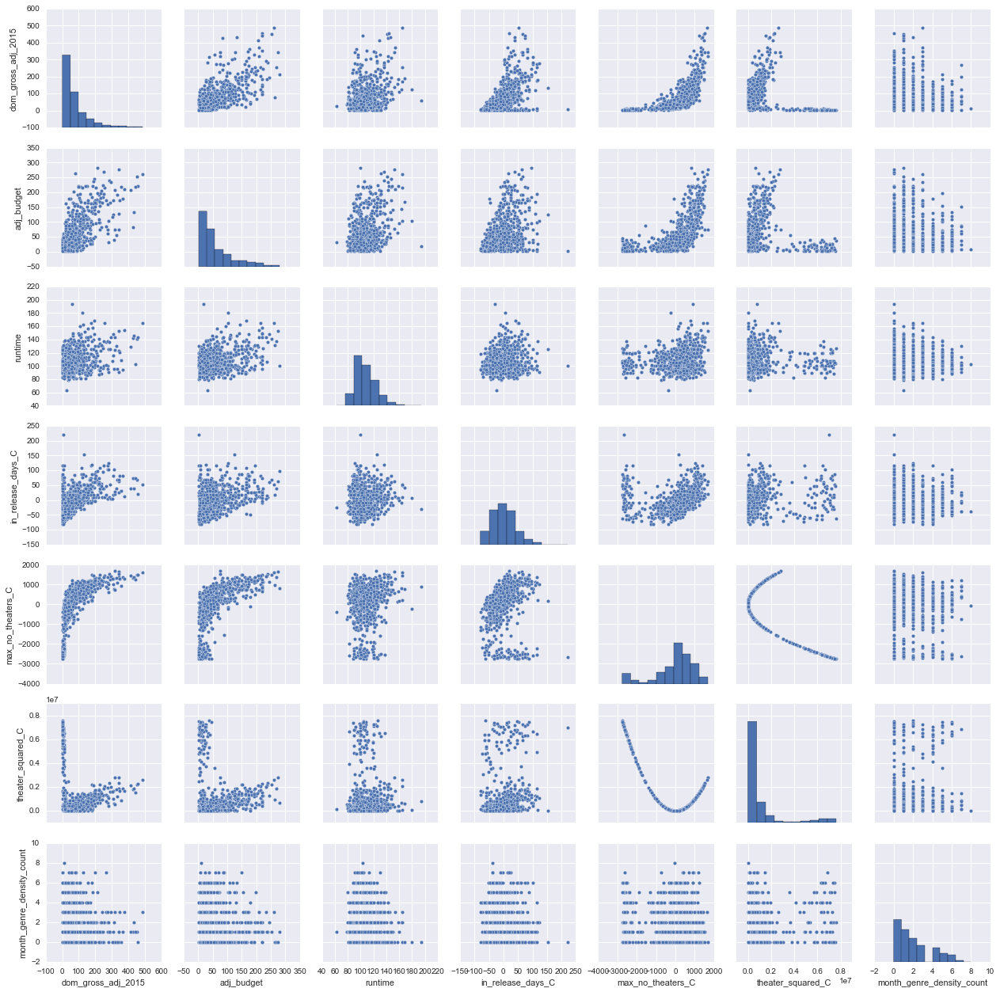
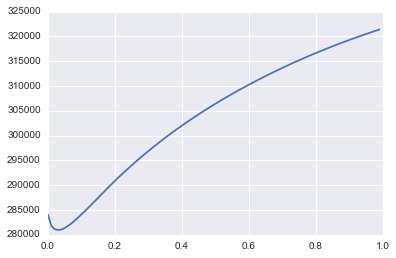

# 1.0 Getting movie links for scraping


```python
# Get Soup
import requests
from bs4 import BeautifulSoup
import re
import dateutil.parser
from PIL import Image
import io
from urllib.request import urlopen
import time
import calendar

##Page list 
pagelist2015 = ['http://www.boxofficemojo.com/yearly/chart/?page=1&view=releasedate&view2=domestic&yr=2015&p=.htm','http://www.boxofficemojo.com/yearly/chart/?page=2&view=releasedate&view2=domestic&yr=2015&p=.htm','http://www.boxofficemojo.com/yearly/chart/?page=3&view=releasedate&view2=domestic&yr=2015&p=.htm','http://www.boxofficemojo.com/yearly/chart/?page=4&view=releasedate&view2=domestic&yr=2015&p=.htm','http://www.boxofficemojo.com/yearly/chart/?page=5&view=releasedate&view2=domestic&yr=2015&p=.htm','http://www.boxofficemojo.com/yearly/chart/?page=6&view=releasedate&view2=domestic&yr=2015&p=.htm','http://www.boxofficemojo.com/yearly/chart/?page=7&view=releasedate&view2=domestic&yr=2015&p=.htm']
pagelist2014 = ['http://www.boxofficemojo.com/yearly/chart/?yr=2014&adjust_yr=2015&p=.htm','http://www.boxofficemojo.com/yearly/chart/?page=2&view=releasedate&view2=domestic&yr=2014&adjust_mo=&adjust_yr=2015&p=.htm','http://www.boxofficemojo.com/yearly/chart/?page=3&view=releasedate&view2=domestic&yr=2014&adjust_mo=&adjust_yr=2015&p=.htm','http://www.boxofficemojo.com/yearly/chart/?page=4&view=releasedate&view2=domestic&yr=2014&adjust_mo=&adjust_yr=2015&p=.htm','http://www.boxofficemojo.com/yearly/chart/?page=5&view=releasedate&view2=domestic&yr=2014&adjust_mo=&adjust_yr=2015&p=.htm','http://www.boxofficemojo.com/yearly/chart/?page=6&view=releasedate&view2=domestic&yr=2014&adjust_mo=&adjust_yr=2015&p=.htm','http://www.boxofficemojo.com/yearly/chart/?page=7&view=releasedate&view2=domestic&yr=2014&adjust_mo=&adjust_yr=2015&p=.htm']
pagelist2013 = ['http://www.boxofficemojo.com/yearly/chart/?yr=2013&adjust_yr=2015&p=.htm','http://www.boxofficemojo.com/yearly/chart/?page=2&view=releasedate&view2=domestic&yr=2013&adjust_mo=&adjust_yr=2015&p=.htm','http://www.boxofficemojo.com/yearly/chart/?page=3&view=releasedate&view2=domestic&yr=2013&adjust_mo=&adjust_yr=2015&p=.htm','http://www.boxofficemojo.com/yearly/chart/?page=4&view=releasedate&view2=domestic&yr=2013&adjust_mo=&adjust_yr=2015&p=.htm','http://www.boxofficemojo.com/yearly/chart/?page=5&view=releasedate&view2=domestic&yr=2013&adjust_mo=&adjust_yr=2015&p=.htm','http://www.boxofficemojo.com/yearly/chart/?page=6&view=releasedate&view2=domestic&yr=2013&adjust_mo=&adjust_yr=2015&p=.htm','http://www.boxofficemojo.com/yearly/chart/?page=7&view=releasedate&view2=domestic&yr=2013&adjust_mo=&adjust_yr=2015&p=.htm']
pagelist2012 = ['http://www.boxofficemojo.com/yearly/chart/?yr=2012&adjust_yr=2015&p=.htm','http://www.boxofficemojo.com/yearly/chart/?page=2&view=releasedate&view2=domestic&yr=2012&adjust_mo=&adjust_yr=2015&p=.htm','http://www.boxofficemojo.com/yearly/chart/?page=3&view=releasedate&view2=domestic&yr=2012&adjust_mo=&adjust_yr=2015&p=.htm','http://www.boxofficemojo.com/yearly/chart/?page=4&view=releasedate&view2=domestic&yr=2012&adjust_mo=&adjust_yr=2015&p=.htm','http://www.boxofficemojo.com/yearly/chart/?page=5&view=releasedate&view2=domestic&yr=2012&adjust_mo=&adjust_yr=2015&p=.htm','http://www.boxofficemojo.com/yearly/chart/?page=6&view=releasedate&view2=domestic&yr=2012&adjust_mo=&adjust_yr=2015&p=.htm','http://www.boxofficemojo.com/yearly/chart/?page=7&view=releasedate&view2=domestic&yr=2012&adjust_mo=&adjust_yr=2015&p=.htm']
pagelist2011 = ['http://www.boxofficemojo.com/yearly/chart/?yr=2011&adjust_yr=2015&p=.htm','http://www.boxofficemojo.com/yearly/chart/?page=2&view=releasedate&view2=domestic&yr=2011&adjust_mo=&adjust_yr=2015&p=.htm','http://www.boxofficemojo.com/yearly/chart/?page=3&view=releasedate&view2=domestic&yr=2011&adjust_mo=&adjust_yr=2015&p=.htm','http://www.boxofficemojo.com/yearly/chart/?page=4&view=releasedate&view2=domestic&yr=2011&adjust_mo=&adjust_yr=2015&p=.htm','http://www.boxofficemojo.com/yearly/chart/?page=5&view=releasedate&view2=domestic&yr=2011&adjust_mo=&adjust_yr=2015&p=.htm','http://www.boxofficemojo.com/yearly/chart/?page=6&view=releasedate&view2=domestic&yr=2011&adjust_mo=&adjust_yr=2015&p=.htm','http://www.boxofficemojo.com/yearly/chart/?page=7&view=releasedate&view2=domestic&yr=2011&adjust_mo=&adjust_yr=2015&p=.htm']
pagelist2010 = ['http://www.boxofficemojo.com/yearly/chart/?yr=2010&adjust_yr=2015&p=.htm','http://www.boxofficemojo.com/yearly/chart/?page=2&view=releasedate&view2=domestic&yr=2010&adjust_mo=&adjust_yr=2015&p=.htm','http://www.boxofficemojo.com/yearly/chart/?page=3&view=releasedate&view2=domestic&yr=2010&adjust_mo=&adjust_yr=2015&p=.htm','http://www.boxofficemojo.com/yearly/chart/?page=4&view=releasedate&view2=domestic&yr=2010&adjust_mo=&adjust_yr=2015&p=.htm','http://www.boxofficemojo.com/yearly/chart/?page=5&view=releasedate&view2=domestic&yr=2010&adjust_mo=&adjust_yr=2015&p=.htm','http://www.boxofficemojo.com/yearly/chart/?page=6&view=releasedate&view2=domestic&yr=2010&adjust_mo=&adjust_yr=2015&p=.htm']
pagelist2009 = ['http://www.boxofficemojo.com/yearly/chart/?yr=2009&adjust_yr=2015&p=.htm','http://www.boxofficemojo.com/yearly/chart/?page=2&view=releasedate&view2=domestic&yr=2009&adjust_mo=&adjust_yr=2015&p=.htm','http://www.boxofficemojo.com/yearly/chart/?page=3&view=releasedate&view2=domestic&yr=2009&adjust_mo=&adjust_yr=2015&p=.htm','http://www.boxofficemojo.com/yearly/chart/?page=4&view=releasedate&view2=domestic&yr=2009&adjust_mo=&adjust_yr=2015&p=.htm','http://www.boxofficemojo.com/yearly/chart/?page=5&view=releasedate&view2=domestic&yr=2009&adjust_mo=&adjust_yr=2015&p=.htm','http://www.boxofficemojo.com/yearly/chart/?page=6&view=releasedate&view2=domestic&yr=2009&adjust_mo=&adjust_yr=2015&p=.htm']
pagelist = pagelist2015 + pagelist2014 + pagelist2013 + pagelist2012 + pagelist2011 + pagelist2010 + pagelist2009 
```


```python
##Find movie links based on page list
movielist = []
for page in pagelist:
    url = page
    response = requests.get(url,headers={'Microsoft Edge':'Metis data science student scraping project'})
    soup = BeautifulSoup(response.text)
    for x in soup.find_all('a'):
        try:
            if "/movies/?id" in x['href']:
                movielist.append(x['href'])
            else:
                continue
        except:
            continue
            
##Translate movie links into full html addresses
htmllist = []
for x in movielist:
    htmllist.append('http://www.boxofficemojo.com'+x+'&adjust_yr=2015&p=.htm')
    
htmllist = list(set(htmllist)) ##Remove duplicates
```

    C:\Users\kennd\Anaconda3\lib\site-packages\bs4\__init__.py:166: UserWarning: No parser was explicitly specified, so I'm using the best available HTML parser for this system ("lxml"). This usually isn't a problem, but if you run this code on another system, or in a different virtual environment, it may use a different parser and behave differently.
    
    To get rid of this warning, change this:
    
     BeautifulSoup([your markup])
    
    to this:
    
     BeautifulSoup([your markup], "lxml")
    
      markup_type=markup_type))
    


```python
len(htmllist)
```


    4411


# 2.0 Scraping Script


```python
## Import BeautifulSoup and scraping modules
from bs4 import BeautifulSoup
import requests
import re
#url = 'http://www.boxofficemojo.com/movies/?id=fruitvale.htm'
#response = requests.get(url,headers={'Microsoft Edge':'Metis data science student scraping project'})
#soup = BeautifulSoup(response.text)
```

## 2.1 Subfunctions to extract data from movie webpages


```python
##Get movie title
def get_movie_title(soup):
    try:
        return soup.find('title').text.split('-')[0].split('(')[0].strip()
    except:
        return None

##Get movie domestic box office gross
def get_movie_domestic_gross(soup):
    try:
        return float(soup.find_all('b')[2].text.replace('$','').replace(',',''))/(10**6)
    except:
        return None
    
##Get movie distributor
def get_movie_distributor(soup):
    try:
        return soup.find(text=re.compile('Distributor')).findNextSibling().text.replace('/',' ').split()[0]
    except:
        return None
    
##Get movie release date
def get_movie_release_date(soup):
    try:
        datestring = soup.find(text=re.compile('Release Date')).findNextSibling().text
        date = dateutil.parser.parse(datestring)
        return date
    except:
        return None
        
##Get movie genre
def get_movie_genre(soup):
    try:
        return soup.find(text=re.compile('Genre:')).findNextSibling().text.split()[0]
    except:
        return None
    
##Get movie runtime
def get_movie_runtime(soup):
    try:
        runtime_string= soup.find(text=re.compile('Runtime')).findNextSibling().text.split()
        return float(runtime_string[0])*60 + float(runtime_string[2])
    except:
        return None

##Get movie MPAA rating
def get_movie_mpaa_rating(soup):
    try:
        return soup.find(text=re.compile('MPAA')).findNextSibling().text
    except:
        return None

##Get movie production budget
def get_movie_prod_budget(soup):
    try:
        prod_budget_string = soup.find(text=re.compile('Production Budget')).findNextSibling().text.replace('$','').replace(',','')
        if 'million' in prod_budget_string:
            return float(prod_budget_string.split()[0])
        else:
            return None
    except:
        return None

##Get movie opening weekend gross
def get_movie_weekend_gross(soup):
    if soup.find(text=re.compile('Wide\xa0Opening')):
        try:
            return float(soup.find(text=re.compile('Wide\xa0Opening')).findNext().text.replace('$','').replace(',',''))/(10**6)
        except:
            return None
    elif soup.find(text=re.compile('Opening\xa0Weekend')):
        try:
            return float(soup.find(text=re.compile('Opening\xa0Weekend')).findNext().text.replace('$','').replace(',',''))/(10**6)
        except:
            return None
    else:
        return None

##Get movie in release days
def get_movie_release_days(soup):
    try:
        return abs(float(soup.find(text=re.compile("In Release")).findNext().text.strip().split()[0]))
    except:
        return None
    

##Get movie widest # of theaters:
def get_movie_no_theaters(soup):
    try:
        return abs(float(soup.find(text=re.compile("Widest")).findNext().text.replace(',','').split()[0]))
    except:
        return None
    
def get_color(soup,i):
    try:
        imagelist = []
        for x in soup.findAll('img'):
            if x['src']:
                imagelist.append(x['src'])      
        fd = urlopen(imagelist[4])
        image_file = io.BytesIO(fd.read())
        im = Image.open(image_file)
        Rlist = []
        Glist = []
        Blist = []
        for pixel in list(im.getdata()):
            Rlist.append(pixel[0])
            Glist.append(pixel[1])
            Blist.append(pixel[2])
        AveR = sum(Rlist)/len(Rlist)
        AveG = sum(Glist)/len(Glist)
        AveB = sum(Blist)/len(Blist)
        return list([AveR,AveG,AveB])[i]
    except:
        return None
```

## 2.2  Combine subfunctions into one function


```python
def get_movie_data(soup):
    datalist = []
    datalist.append(get_movie_title(soup))
    datalist.append(get_movie_domestic_gross(soup))
    datalist.append(get_movie_distributor(soup))
    datalist.append(get_movie_release_date(soup))
    datalist.append(get_movie_genre(soup))
    datalist.append(get_movie_runtime(soup))
    datalist.append(get_movie_mpaa_rating(soup))
    datalist.append(get_movie_prod_budget(soup))
    datalist.append(get_movie_weekend_gross(soup))
    datalist.append(get_movie_release_days(soup))
    datalist.append(get_movie_no_theaters(soup))
    datalist.append(get_color(soup,0))
    datalist.append(get_color(soup,1))
    datalist.append(get_color(soup,2))
    df.append(datalist)
```

## 2.3 Loop through links and combine into one data frame


```python
##Set df as master list
df = []
count = 0
for link in htmllist:
    try:
        count += 1
        print(count)
        time.sleep(0.01)
        response = requests.get(link,headers={'Microsoft Edge':'Metis data science student scraping project'})
        soup = BeautifulSoup(response.text)
        get_movie_data(soup)
    except:
        print('Error')
```

    1
    

    C:\Users\kennd\Anaconda3\lib\site-packages\bs4\__init__.py:166: UserWarning: No parser was explicitly specified, so I'm using the best available HTML parser for this system ("lxml"). This usually isn't a problem, but if you run this code on another system, or in a different virtual environment, it may use a different parser and behave differently.
    
    To get rid of this warning, change this:
    
     BeautifulSoup([your markup])
    
    to this:
    
     BeautifulSoup([your markup], "lxml")
    
      markup_type=markup_type))
    

    2
    3
    4
    5
    6
    7
    8
    9
    10
    11
    12
    13
    14
    15
    16
    17
    18
    19
    20
    21
    22
    23
    24
    25
    26
    27
    28
    29
    30
    31
    32
    33
    34
    35
    36
    37
    38
    39
    40
    41
    42
    43
    44
    45
    46
    47
    48
    49
    50
    51
    52
    53
    54
    55
    56
    57
    58
    59
    60
    61
    62
    63
    64
    65
    66
    67
    68
    69
    70
    71
    72
    73
    74
    75
    76
    77
    78
    79
    80
    81
    82
    83
    84
    85
    86
    87
    88
    89
    90
    91
    92
    93
    94
    95
    96
    97
    98
    99
    100
    101
    102
    103
    104
    105
    106
    107
    108
    109
    110
    111
    112
    113
    114
    115
    116
    117
    118
    119
    120
    121
    122
    123
    124
    125
    126
    127
    128
    129
    130
    131
    132
    133
    134
    135
    136
    137
    138
    139
    140
    141
    142
    143
    144
    145
    146
    147
    148
    149
    150
    151
    152
    153
    154
    155
    156
    157
    158
    159
    160
    161
    162
    163
    164
    165
    166
    167
    168
    169
    170
    171
    172
    173
    174
    175
    176
    177
    178
    179
    180
    181
    182
    183
    184
    185
    186
    187
    188
    189
    190
    191
    192
    193
    194
    195
    196
    197
    198
    199
    200
    201
    202
    203
    204
    205
    206
    207
    208
    209
    210
    211
    212
    213
    214
    215
    216
    217
    218
    219
    220
    221
    222
    223
    224
    225
    226
    227
    228
    229
    230
    231
    232
    233
    234
    235
    236
    237
    238
    239
    240
    241
    242
    243
    244
    245
    246
    247
    248
    249
    250
    251
    252
    253
    254
    255
    256
    257
    258
    259
    260
    261
    262
    263
    264
    265
    266
    267
    268
    269
    270
    271
    272
    273
    274
    275
    276
    277
    278
    279
    280
    281
    282
    283
    284
    285
    286
    287
    288
    289
    290
    291
    292
    293
    294
    295
    296
    297
    298
    299
    300
    301
    302
    303
    304
    305
    306
    307
    308
    309
    310
    311
    312
    313
    314
    315
    316
    317
    318
    319
    320
    321
    322
    323
    324
    325
    326
    327
    328
    329
    330
    331
    332
    333
    334
    335
    336
    337
    338
    339
    340
    341
    342
    343
    344
    345
    346
    347
    348
    349
    350
    351
    352
    353
    354
    355
    356
    357
    358
    359
    360
    361
    362
    363
    364
    365
    366
    367
    368
    369
    370
    371
    372
    373
    374
    375
    376
    377
    378
    379
    380
    381
    382
    383
    384
    385
    386
    387
    388
    389
    390
    391
    392
    393
    394
    395
    396
    397
    398
    399
    400
    401
    402
    403
    404
    405
    406
    407
    408
    409
    410
    411
    412
    413
    414
    415
    416
    417
    418
    419
    420
    421
    422
    423
    424
    425
    426
    427
    428
    429
    430
    431
    432
    433
    434
    435
    436
    437
    438
    439
    440
    441
    442
    443
    444
    445
    446
    447
    448
    449
    450
    451
    452
    453
    454
    455
    456
    457
    458
    459
    460
    461
    462
    463
    464
    465
    466
    467
    468
    469
    470
    471
    472
    473
    474
    475
    476
    477
    478
    479
    480
    481
    482
    483
    484
    485
    486
    487
    488
    489
    490
    491
    492
    493
    494
    495
    496
    497
    498
    499
    500
    501
    502
    503
    504
    505
    506
    507
    508
    509
    510
    511
    512
    513
    514
    515
    516
    517
    518
    519
    520
    521
    522
    523
    524
    525
    526
    527
    528
    529
    530
    531
    532
    533
    534
    535
    536
    537
    538
    539
    540
    541
    542
    543
    544
    545
    546
    547
    548
    549
    550
    551
    552
    553
    554
    555
    556
    557
    558
    559
    560
    561
    562
    563
    564
    565
    566
    567
    568
    569
    570
    571
    572
    573
    574
    575
    576
    577
    578
    579
    580
    581
    582
    583
    584
    585
    586
    587
    588
    589
    590
    591
    592
    593
    594
    595
    596
    597
    598
    599
    600
    601
    602
    603
    604
    605
    606
    607
    608
    609
    610
    611
    612
    613
    614
    615
    616
    617
    618
    619
    620
    621
    622
    623
    624
    625
    626
    627
    628
    629
    630
    631
    632
    633
    634
    635
    636
    637
    638
    639
    640
    641
    642
    643
    644
    645
    646
    647
    648
    649
    650
    651
    652
    653
    654
    655
    656
    657
    658
    659
    660
    661
    662
    663
    664
    665
    666
    667
    668
    669
    670
    671
    672
    673
    674
    675
    676
    677
    678
    679
    680
    681
    682
    683
    684
    685
    686
    687
    688
    689
    690
    691
    692
    693
    694
    695
    696
    697
    698
    699
    700
    701
    702
    703
    704
    705
    706
    707
    708
    709
    710
    711
    712
    713
    714
    715
    716
    717
    718
    719
    720
    721
    722
    723
    724
    725
    726
    727
    728
    729
    730
    731
    732
    733
    734
    735
    736
    737
    738
    739
    740
    741
    742
    743
    744
    745
    746
    747
    748
    749
    750
    751
    752
    753
    754
    755
    756
    757
    758
    759
    760
    761
    762
    763
    764
    765
    766
    767
    768
    769
    770
    771
    772
    773
    774
    775
    776
    777
    778
    779
    780
    781
    782
    783
    784
    785
    786
    787
    788
    789
    790
    791
    792
    793
    794
    795
    796
    797
    798
    799
    800
    801
    802
    803
    804
    805
    806
    807
    808
    809
    810
    811
    812
    813
    814
    815
    816
    817
    818
    819
    820
    821
    822
    823
    824
    825
    826
    827
    828
    829
    830
    831
    832
    833
    834
    835
    836
    837
    838
    839
    840
    841
    842
    843
    844
    845
    846
    847
    848
    849
    850
    851
    852
    853
    854
    855
    856
    857
    858
    859
    860
    861
    862
    863
    864
    865
    866
    867
    868
    869
    870
    871
    872
    873
    874
    875
    876
    877
    878
    879
    880
    881
    882
    883
    884
    885
    886
    887
    888
    889
    890
    891
    892
    893
    894
    895
    896
    897
    898
    899
    900
    901
    902
    903
    904
    905
    906
    907
    908
    909
    910
    911
    912
    913
    914
    915
    916
    917
    918
    919
    920
    921
    922
    923
    924
    925
    926
    927
    928
    929
    930
    931
    932
    933
    934
    935
    936
    937
    938
    939
    940
    941
    942
    943
    944
    945
    946
    947
    948
    949
    950
    951
    952
    953
    954
    955
    956
    957
    958
    959
    960
    961
    962
    963
    964
    965
    966
    967
    968
    969
    970
    971
    972
    973
    974
    975
    976
    977
    978
    979
    980
    981
    982
    983
    984
    985
    986
    987
    988
    989
    990
    991
    992
    993
    994
    995
    996
    997
    998
    999
    1000
    1001
    1002
    1003
    1004
    1005
    1006
    1007
    1008
    1009
    1010
    1011
    1012
    1013
    1014
    1015
    1016
    1017
    1018
    1019
    1020
    1021
    1022
    1023
    1024
    1025
    1026
    1027
    1028
    1029
    1030
    1031
    1032
    1033
    1034
    1035
    1036
    1037
    1038
    1039
    1040
    1041
    1042
    1043
    1044
    1045
    1046
    1047
    1048
    1049
    1050
    1051
    1052
    1053
    1054
    1055
    1056
    1057
    1058
    1059
    1060
    1061
    1062
    1063
    1064
    1065
    1066
    1067
    1068
    1069
    1070
    1071
    1072
    1073
    1074
    1075
    1076
    1077
    1078
    1079
    1080
    1081
    1082
    1083
    1084
    1085
    1086
    1087
    1088
    1089
    1090
    1091
    1092
    1093
    1094
    1095
    1096
    1097
    1098
    1099
    1100
    1101
    1102
    1103
    1104
    1105
    1106
    1107
    1108
    1109
    1110
    1111
    1112
    1113
    1114
    1115
    1116
    1117
    1118
    1119
    1120
    1121
    1122
    1123
    1124
    1125
    1126
    1127
    1128
    1129
    1130
    1131
    1132
    1133
    1134
    1135
    1136
    1137
    1138
    1139
    1140
    1141
    1142
    1143
    1144
    1145
    1146
    1147
    1148
    1149
    1150
    1151
    1152
    1153
    1154
    1155
    1156
    1157
    1158
    1159
    1160
    1161
    1162
    1163
    1164
    1165
    1166
    1167
    1168
    1169
    1170
    1171
    1172
    1173
    1174
    1175
    1176
    1177
    1178
    1179
    1180
    1181
    1182
    1183
    1184
    1185
    1186
    1187
    1188
    1189
    1190
    1191
    1192
    1193
    1194
    1195
    1196
    1197
    1198
    1199
    1200
    1201
    1202
    1203
    1204
    1205
    1206
    1207
    1208
    1209
    1210
    1211
    1212
    1213
    1214
    1215
    1216
    1217
    1218
    1219
    1220
    1221
    1222
    1223
    1224
    1225
    1226
    1227
    1228
    1229
    1230
    1231
    1232
    1233
    1234
    1235
    1236
    1237
    1238
    1239
    1240
    1241
    1242
    1243
    1244
    1245
    1246
    1247
    1248
    1249
    1250
    1251
    1252
    1253
    1254
    1255
    1256
    1257
    1258
    1259
    1260
    1261
    1262
    1263
    1264
    1265
    1266
    1267
    1268
    1269
    1270
    1271
    1272
    1273
    1274
    1275
    1276
    1277
    1278
    1279
    1280
    1281
    1282
    1283
    1284
    1285
    1286
    1287
    1288
    1289
    1290
    1291
    1292
    1293
    1294
    1295
    1296
    1297
    1298
    1299
    1300
    1301
    1302
    1303
    1304
    1305
    1306
    1307
    1308
    1309
    1310
    1311
    1312
    1313
    1314
    1315
    1316
    1317
    1318
    1319
    1320
    1321
    1322
    1323
    1324
    1325
    1326
    1327
    1328
    1329
    1330
    1331
    1332
    1333
    1334
    1335
    1336
    1337
    1338
    1339
    1340
    1341
    1342
    1343
    1344
    1345
    1346
    1347
    1348
    1349
    1350
    1351
    1352
    1353
    1354
    1355
    1356
    1357
    1358
    1359
    1360
    1361
    1362
    1363
    1364
    1365
    1366
    1367
    1368
    1369
    1370
    1371
    1372
    1373
    1374
    1375
    1376
    1377
    1378
    1379
    1380
    1381
    1382
    1383
    1384
    1385
    1386
    1387
    1388
    1389
    1390
    1391
    1392
    1393
    1394
    1395
    1396
    1397
    1398
    1399
    1400
    1401
    1402
    1403
    1404
    1405
    1406
    1407
    1408
    1409
    1410
    1411
    1412
    1413
    1414
    1415
    1416
    1417
    1418
    1419
    1420
    1421
    1422
    1423
    1424
    1425
    1426
    1427
    1428
    1429
    1430
    1431
    1432
    1433
    1434
    1435
    1436
    1437
    1438
    1439
    1440
    1441
    1442
    1443
    1444
    1445
    1446
    1447
    1448
    1449
    1450
    1451
    1452
    1453
    1454
    1455
    1456
    1457
    1458
    1459
    1460
    1461
    1462
    1463
    1464
    1465
    1466
    1467
    1468
    1469
    1470
    1471
    1472
    1473
    1474
    1475
    1476
    1477
    1478
    1479
    1480
    1481
    1482
    1483
    1484
    1485
    1486
    1487
    1488
    1489
    1490
    1491
    1492
    1493
    1494
    1495
    1496
    1497
    1498
    1499
    1500
    1501
    1502
    1503
    1504
    1505
    1506
    1507
    1508
    1509
    1510
    1511
    1512
    1513
    1514
    1515
    1516
    1517
    1518
    1519
    1520
    1521
    1522
    1523
    1524
    1525
    1526
    1527
    1528
    1529
    1530
    1531
    1532
    1533
    1534
    1535
    1536
    1537
    1538
    1539
    1540
    1541
    1542
    1543
    1544
    1545
    1546
    1547
    1548
    1549
    1550
    1551
    1552
    1553
    1554
    1555
    1556
    1557
    1558
    1559
    1560
    1561
    1562
    1563
    1564
    1565
    1566
    1567
    1568
    1569
    1570
    1571
    1572
    1573
    1574
    1575
    1576
    1577
    1578
    1579
    1580
    1581
    1582
    1583
    1584
    1585
    1586
    1587
    1588
    1589
    1590
    1591
    1592
    1593
    1594
    1595
    1596
    1597
    1598
    1599
    1600
    1601
    1602
    1603
    1604
    1605
    1606
    1607
    1608
    1609
    1610
    1611
    1612
    1613
    1614
    1615
    1616
    1617
    1618
    1619
    1620
    1621
    1622
    1623
    1624
    1625
    1626
    1627
    1628
    1629
    1630
    1631
    1632
    1633
    1634
    1635
    1636
    1637
    1638
    1639
    1640
    1641
    1642
    1643
    1644
    1645
    1646
    1647
    1648
    1649
    1650
    1651
    1652
    1653
    1654
    1655
    1656
    1657
    1658
    1659
    1660
    1661
    1662
    1663
    1664
    1665
    1666
    1667
    1668
    1669
    1670
    1671
    1672
    1673
    1674
    1675
    1676
    1677
    1678
    1679
    1680
    1681
    1682
    1683
    1684
    1685
    1686
    1687
    1688
    1689
    1690
    1691
    1692
    1693
    1694
    1695
    1696
    1697
    1698
    1699
    1700
    1701
    1702
    1703
    1704
    1705
    1706
    1707
    1708
    1709
    1710
    1711
    1712
    1713
    1714
    1715
    1716
    1717
    1718
    1719
    1720
    1721
    1722
    1723
    1724
    1725
    1726
    1727
    1728
    1729
    1730
    1731
    1732
    1733
    1734
    1735
    1736
    1737
    1738
    1739
    1740
    1741
    1742
    1743
    1744
    1745
    1746
    1747
    1748
    1749
    1750
    1751
    1752
    1753
    1754
    1755
    1756
    1757
    1758
    1759
    1760
    1761
    1762
    1763
    1764
    1765
    1766
    1767
    1768
    1769
    1770
    1771
    1772
    1773
    1774
    1775
    1776
    1777
    1778
    1779
    1780
    1781
    1782
    1783
    1784
    1785
    1786
    1787
    1788
    1789
    1790
    1791
    1792
    1793
    1794
    1795
    1796
    1797
    1798
    1799
    1800
    1801
    1802
    1803
    1804
    1805
    1806
    1807
    1808
    1809
    1810
    1811
    1812
    1813
    1814
    1815
    1816
    1817
    1818
    1819
    1820
    1821
    1822
    1823
    1824
    1825
    1826
    1827
    1828
    1829
    1830
    1831
    1832
    1833
    1834
    1835
    1836
    1837
    1838
    1839
    1840
    1841
    1842
    1843
    1844
    1845
    1846
    1847
    1848
    1849
    1850
    1851
    1852
    1853
    1854
    1855
    1856
    1857
    1858
    1859
    1860
    1861
    1862
    1863
    1864
    1865
    1866
    1867
    1868
    1869
    1870
    1871
    1872
    1873
    1874
    1875
    1876
    1877
    1878
    1879
    1880
    1881
    1882
    1883
    1884
    1885
    1886
    1887
    1888
    1889
    1890
    1891
    1892
    1893
    1894
    1895
    1896
    1897
    1898
    1899
    1900
    1901
    1902
    1903
    1904
    1905
    1906
    1907
    1908
    1909
    1910
    1911
    1912
    1913
    1914
    1915
    1916
    1917
    1918
    1919
    1920
    1921
    1922
    1923
    1924
    1925
    1926
    1927
    1928
    1929
    1930
    1931
    1932
    1933
    1934
    1935
    1936
    1937
    1938
    1939
    1940
    1941
    1942
    1943
    1944
    1945
    1946
    1947
    1948
    1949
    1950
    1951
    1952
    1953
    1954
    1955
    1956
    1957
    1958
    1959
    1960
    1961
    1962
    1963
    1964
    1965
    1966
    1967
    1968
    1969
    1970
    1971
    1972
    1973
    1974
    1975
    1976
    1977
    1978
    1979
    1980
    1981
    1982
    1983
    1984
    1985
    1986
    1987
    1988
    1989
    1990
    1991
    1992
    1993
    1994
    1995
    1996
    1997
    1998
    1999
    2000
    2001
    2002
    2003
    2004
    2005
    2006
    2007
    2008
    2009
    2010
    2011
    2012
    2013
    2014
    2015
    2016
    2017
    2018
    2019
    2020
    2021
    2022
    2023
    2024
    2025
    2026
    2027
    2028
    2029
    2030
    2031
    2032
    2033
    2034
    2035
    2036
    2037
    2038
    2039
    2040
    2041
    2042
    2043
    2044
    2045
    2046
    2047
    2048
    2049
    2050
    2051
    2052
    2053
    2054
    2055
    2056
    2057
    2058
    2059
    2060
    2061
    2062
    2063
    2064
    2065
    2066
    2067
    2068
    2069
    2070
    2071
    2072
    2073
    2074
    2075
    2076
    2077
    2078
    2079
    2080
    2081
    2082
    2083
    2084
    2085
    2086
    2087
    2088
    2089
    2090
    2091
    2092
    2093
    2094
    2095
    2096
    2097
    2098
    2099
    2100
    2101
    2102
    2103
    2104
    2105
    2106
    2107
    2108
    2109
    2110
    2111
    2112
    2113
    2114
    2115
    2116
    2117
    2118
    2119
    2120
    2121
    2122
    2123
    2124
    2125
    2126
    2127
    2128
    2129
    2130
    2131
    2132
    2133
    2134
    2135
    2136
    2137
    2138
    2139
    2140
    2141
    2142
    2143
    2144
    2145
    2146
    2147
    2148
    2149
    2150
    2151
    2152
    2153
    2154
    2155
    2156
    2157
    2158
    2159
    2160
    2161
    2162
    2163
    2164
    2165
    2166
    2167
    2168
    2169
    2170
    2171
    2172
    2173
    2174
    2175
    2176
    2177
    2178
    2179
    2180
    2181
    2182
    2183
    2184
    2185
    2186
    2187
    2188
    2189
    2190
    2191
    2192
    2193
    2194
    2195
    2196
    2197
    2198
    2199
    2200
    2201
    2202
    2203
    2204
    2205
    2206
    2207
    2208
    2209
    2210
    2211
    2212
    2213
    2214
    2215
    2216
    2217
    2218
    2219
    2220
    2221
    2222
    2223
    2224
    2225
    2226
    2227
    2228
    2229
    2230
    2231
    2232
    2233
    2234
    2235
    2236
    2237
    2238
    2239
    2240
    2241
    2242
    2243
    2244
    2245
    2246
    2247
    2248
    2249
    2250
    2251
    2252
    2253
    2254
    2255
    2256
    2257
    2258
    2259
    2260
    2261
    2262
    2263
    2264
    2265
    2266
    2267
    2268
    2269
    2270
    2271
    2272
    2273
    2274
    2275
    2276
    2277
    2278
    2279
    2280
    2281
    2282
    2283
    2284
    2285
    2286
    2287
    2288
    2289
    2290
    2291
    2292
    2293
    2294
    2295
    2296
    2297
    2298
    2299
    2300
    2301
    2302
    2303
    2304
    2305
    2306
    2307
    2308
    2309
    2310
    2311
    2312
    2313
    2314
    2315
    2316
    2317
    2318
    2319
    2320
    2321
    2322
    2323
    2324
    2325
    2326
    2327
    2328
    2329
    2330
    2331
    2332
    2333
    2334
    2335
    2336
    2337
    2338
    2339
    2340
    2341
    2342
    2343
    2344
    2345
    2346
    2347
    2348
    2349
    2350
    2351
    2352
    2353
    2354
    2355
    2356
    2357
    2358
    2359
    2360
    2361
    2362
    2363
    2364
    2365
    2366
    2367
    2368
    2369
    2370
    2371
    2372
    2373
    2374
    2375
    2376
    2377
    2378
    2379
    2380
    2381
    2382
    2383
    2384
    2385
    2386
    2387
    2388
    2389
    2390
    2391
    2392
    2393
    2394
    2395
    2396
    2397
    2398
    2399
    2400
    2401
    2402
    2403
    2404
    2405
    2406
    2407
    2408
    2409
    2410
    2411
    2412
    2413
    2414
    2415
    2416
    2417
    2418
    2419
    2420
    2421
    2422
    2423
    2424
    2425
    2426
    2427
    2428
    2429
    2430
    2431
    2432
    2433
    2434
    2435
    2436
    2437
    2438
    2439
    2440
    2441
    2442
    2443
    2444
    2445
    2446
    2447
    2448
    2449
    2450
    2451
    2452
    2453
    2454
    2455
    2456
    2457
    2458
    2459
    2460
    2461
    2462
    2463
    2464
    2465
    2466
    2467
    2468
    2469
    2470
    2471
    2472
    2473
    2474
    2475
    2476
    2477
    2478
    2479
    2480
    2481
    2482
    2483
    2484
    2485
    2486
    2487
    2488
    2489
    2490
    2491
    2492
    2493
    2494
    2495
    2496
    2497
    2498
    2499
    2500
    2501
    2502
    2503
    2504
    2505
    2506
    2507
    2508
    2509
    2510
    2511
    2512
    2513
    2514
    2515
    2516
    2517
    2518
    2519
    2520
    2521
    2522
    2523
    2524
    2525
    2526
    2527
    2528
    2529
    2530
    2531
    2532
    2533
    2534
    2535
    2536
    2537
    2538
    2539
    2540
    2541
    2542
    2543
    2544
    2545
    2546
    2547
    2548
    2549
    2550
    2551
    2552
    2553
    2554
    2555
    2556
    2557
    2558
    2559
    2560
    2561
    2562
    2563
    2564
    2565
    2566
    2567
    2568
    2569
    2570
    2571
    2572
    2573
    2574
    2575
    2576
    2577
    2578
    2579
    2580
    2581
    2582
    2583
    2584
    2585
    2586
    2587
    2588
    2589
    2590
    2591
    2592
    2593
    2594
    2595
    2596
    2597
    2598
    2599
    2600
    2601
    2602
    2603
    2604
    2605
    2606
    2607
    2608
    2609
    2610
    2611
    2612
    2613
    2614
    2615
    2616
    2617
    2618
    2619
    2620
    2621
    2622
    2623
    2624
    2625
    2626
    2627
    2628
    2629
    2630
    2631
    2632
    2633
    2634
    2635
    2636
    2637
    2638
    2639
    2640
    2641
    2642
    2643
    2644
    2645
    2646
    2647
    2648
    2649
    2650
    2651
    2652
    2653
    2654
    2655
    2656
    2657
    2658
    2659
    2660
    2661
    2662
    2663
    2664
    2665
    2666
    2667
    2668
    2669
    2670
    2671
    2672
    2673
    2674
    2675
    2676
    2677
    2678
    2679
    2680
    2681
    2682
    2683
    2684
    2685
    2686
    2687
    2688
    2689
    2690
    2691
    2692
    2693
    2694
    2695
    2696
    2697
    2698
    2699
    2700
    2701
    2702
    2703
    2704
    2705
    2706
    2707
    2708
    2709
    2710
    2711
    2712
    2713
    2714
    2715
    2716
    2717
    2718
    2719
    2720
    2721
    2722
    2723
    2724
    2725
    2726
    2727
    2728
    2729
    2730
    2731
    2732
    2733
    2734
    2735
    2736
    2737
    2738
    2739
    2740
    2741
    2742
    2743
    2744
    2745
    2746
    2747
    2748
    2749
    2750
    2751
    2752
    2753
    2754
    2755
    2756
    2757
    2758
    2759
    2760
    2761
    2762
    2763
    2764
    2765
    2766
    2767
    2768
    2769
    2770
    2771
    2772
    2773
    2774
    2775
    2776
    2777
    2778
    2779
    2780
    2781
    2782
    2783
    2784
    2785
    2786
    2787
    2788
    2789
    2790
    2791
    2792
    2793
    2794
    2795
    2796
    2797
    2798
    2799
    2800
    2801
    2802
    2803
    2804
    2805
    2806
    2807
    2808
    2809
    2810
    2811
    2812
    2813
    2814
    2815
    2816
    2817
    2818
    2819
    2820
    2821
    2822
    2823
    2824
    2825
    2826
    2827
    2828
    2829
    2830
    2831
    2832
    2833
    2834
    2835
    2836
    2837
    2838
    2839
    2840
    2841
    2842
    2843
    2844
    2845
    2846
    2847
    2848
    2849
    2850
    2851
    2852
    2853
    2854
    2855
    2856
    2857
    2858
    2859
    2860
    2861
    2862
    2863
    2864
    2865
    2866
    2867
    2868
    2869
    2870
    2871
    2872
    2873
    2874
    2875
    2876
    2877
    2878
    2879
    2880
    2881
    2882
    2883
    2884
    2885
    2886
    2887
    2888
    2889
    2890
    2891
    2892
    2893
    2894
    2895
    2896
    2897
    2898
    2899
    2900
    2901
    2902
    2903
    2904
    2905
    2906
    2907
    2908
    2909
    2910
    2911
    2912
    2913
    2914
    2915
    2916
    2917
    2918
    2919
    2920
    2921
    2922
    2923
    2924
    2925
    2926
    2927
    2928
    2929
    2930
    2931
    2932
    2933
    2934
    2935
    2936
    2937
    2938
    2939
    2940
    2941
    2942
    2943
    2944
    2945
    2946
    2947
    2948
    2949
    2950
    2951
    2952
    2953
    2954
    2955
    2956
    2957
    2958
    2959
    2960
    2961
    2962
    2963
    2964
    2965
    2966
    2967
    2968
    2969
    2970
    2971
    2972
    2973
    2974
    2975
    2976
    2977
    2978
    2979
    2980
    2981
    2982
    2983
    2984
    2985
    2986
    2987
    2988
    2989
    2990
    2991
    2992
    2993
    2994
    2995
    2996
    2997
    2998
    2999
    3000
    3001
    3002
    3003
    3004
    3005
    3006
    3007
    3008
    3009
    3010
    3011
    3012
    3013
    3014
    3015
    3016
    3017
    3018
    3019
    3020
    3021
    3022
    3023
    3024
    3025
    3026
    3027
    3028
    3029
    3030
    3031
    3032
    3033
    3034
    3035
    3036
    3037
    3038
    3039
    3040
    3041
    3042
    3043
    3044
    3045
    3046
    3047
    3048
    3049
    3050
    3051
    3052
    3053
    3054
    3055
    3056
    3057
    3058
    3059
    3060
    3061
    3062
    3063
    3064
    3065
    3066
    3067
    3068
    3069
    3070
    3071
    3072
    3073
    3074
    3075
    3076
    3077
    3078
    3079
    3080
    3081
    3082
    3083
    3084
    3085
    3086
    3087
    3088
    3089
    3090
    3091
    3092
    3093
    3094
    3095
    3096
    3097
    3098
    3099
    3100
    3101
    3102
    3103
    3104
    3105
    3106
    3107
    3108
    3109
    3110
    3111
    3112
    3113
    3114
    3115
    3116
    3117
    3118
    3119
    3120
    3121
    3122
    3123
    3124
    3125
    3126
    3127
    3128
    3129
    3130
    3131
    3132
    3133
    3134
    3135
    3136
    3137
    3138
    3139
    3140
    3141
    3142
    3143
    3144
    3145
    3146
    3147
    3148
    3149
    3150
    3151
    3152
    3153
    3154
    3155
    3156
    3157
    3158
    3159
    3160
    3161
    3162
    3163
    3164
    3165
    3166
    3167
    3168
    3169
    3170
    3171
    3172
    3173
    3174
    3175
    3176
    3177
    3178
    3179
    3180
    3181
    3182
    3183
    3184
    3185
    3186
    3187
    3188
    3189
    3190
    3191
    3192
    3193
    3194
    3195
    3196
    3197
    3198
    3199
    3200
    3201
    3202
    3203
    3204
    3205
    3206
    3207
    3208
    3209
    3210
    3211
    3212
    3213
    3214
    3215
    3216
    3217
    3218
    3219
    3220
    3221
    3222
    3223
    3224
    3225
    3226
    3227
    3228
    3229
    3230
    3231
    3232
    3233
    3234
    3235
    3236
    3237
    3238
    3239
    3240
    3241
    3242
    3243
    3244
    3245
    3246
    3247
    3248
    3249
    3250
    3251
    3252
    3253
    3254
    3255
    3256
    3257
    3258
    3259
    3260
    3261
    3262
    3263
    3264
    3265
    3266
    3267
    3268
    3269
    3270
    3271
    3272
    3273
    3274
    3275
    3276
    3277
    3278
    3279
    3280
    3281
    3282
    3283
    3284
    3285
    3286
    3287
    3288
    3289
    3290
    3291
    3292
    3293
    3294
    3295
    3296
    3297
    3298
    3299
    3300
    3301
    3302
    3303
    3304
    3305
    3306
    3307
    3308
    3309
    3310
    3311
    3312
    3313
    3314
    3315
    3316
    3317
    3318
    3319
    3320
    3321
    3322
    3323
    3324
    3325
    3326
    3327
    3328
    3329
    3330
    3331
    3332
    3333
    3334
    3335
    3336
    3337
    3338
    3339
    3340
    3341
    3342
    3343
    3344
    3345
    3346
    3347
    3348
    3349
    3350
    3351
    3352
    3353
    3354
    3355
    3356
    3357
    3358
    3359
    3360
    3361
    3362
    3363
    3364
    3365
    3366
    3367
    3368
    3369
    3370
    3371
    3372
    3373
    3374
    3375
    3376
    3377
    3378
    3379
    3380
    3381
    3382
    3383
    3384
    3385
    3386
    3387
    3388
    3389
    3390
    3391
    3392
    3393
    3394
    3395
    3396
    3397
    3398
    3399
    3400
    3401
    3402
    3403
    3404
    3405
    3406
    3407
    3408
    3409
    3410
    3411
    3412
    3413
    3414
    3415
    3416
    3417
    3418
    3419
    3420
    3421
    3422
    3423
    3424
    3425
    3426
    3427
    3428
    3429
    3430
    3431
    3432
    3433
    3434
    3435
    3436
    3437
    3438
    3439
    3440
    3441
    3442
    3443
    3444
    3445
    3446
    3447
    3448
    3449
    3450
    3451
    3452
    3453
    3454
    3455
    3456
    3457
    3458
    3459
    3460
    3461
    3462
    3463
    3464
    3465
    3466
    3467
    3468
    3469
    3470
    3471
    3472
    3473
    3474
    3475
    3476
    3477
    3478
    3479
    3480
    3481
    3482
    3483
    3484
    3485
    3486
    3487
    3488
    3489
    3490
    3491
    3492
    3493
    3494
    3495
    3496
    3497
    3498
    3499
    3500
    3501
    3502
    3503
    3504
    3505
    3506
    3507
    3508
    3509
    3510
    3511
    3512
    3513
    3514
    3515
    3516
    3517
    3518
    3519
    3520
    3521
    3522
    3523
    3524
    3525
    3526
    3527
    3528
    3529
    3530
    3531
    3532
    3533
    3534
    3535
    3536
    3537
    3538
    3539
    3540
    3541
    3542
    3543
    3544
    3545
    3546
    3547
    3548
    3549
    3550
    3551
    3552
    3553
    3554
    3555
    3556
    3557
    3558
    3559
    3560
    3561
    3562
    3563
    3564
    3565
    3566
    3567
    3568
    3569
    3570
    3571
    3572
    3573
    3574
    3575
    3576
    3577
    3578
    3579
    3580
    3581
    3582
    3583
    3584
    3585
    3586
    3587
    3588
    3589
    3590
    3591
    3592
    3593
    3594
    3595
    3596
    3597
    3598
    3599
    3600
    3601
    3602
    3603
    3604
    3605
    3606
    3607
    3608
    3609
    3610
    3611
    3612
    3613
    3614
    3615
    3616
    3617
    3618
    3619
    3620
    3621
    3622
    3623
    3624
    3625
    3626
    3627
    3628
    3629
    3630
    3631
    3632
    3633
    3634
    3635
    3636
    3637
    3638
    3639
    3640
    3641
    3642
    3643
    3644
    3645
    3646
    3647
    3648
    3649
    3650
    3651
    3652
    3653
    3654
    3655
    3656
    3657
    3658
    3659
    3660
    3661
    3662
    3663
    3664
    3665
    3666
    3667
    3668
    3669
    3670
    3671
    3672
    3673
    3674
    3675
    3676
    3677
    3678
    3679
    3680
    3681
    3682
    3683
    3684
    3685
    3686
    3687
    3688
    3689
    3690
    3691
    3692
    3693
    3694
    3695
    3696
    3697
    3698
    3699
    3700
    3701
    3702
    3703
    3704
    3705
    3706
    3707
    3708
    3709
    3710
    3711
    3712
    3713
    3714
    3715
    3716
    3717
    3718
    3719
    3720
    3721
    3722
    3723
    3724
    3725
    3726
    3727
    3728
    3729
    3730
    3731
    3732
    3733
    3734
    3735
    3736
    3737
    3738
    3739
    3740
    3741
    3742
    3743
    3744
    3745
    3746
    3747
    3748
    3749
    3750
    3751
    3752
    3753
    3754
    3755
    3756
    3757
    3758
    3759
    3760
    3761
    3762
    3763
    3764
    3765
    3766
    3767
    3768
    3769
    3770
    3771
    3772
    3773
    3774
    3775
    3776
    3777
    3778
    3779
    3780
    3781
    3782
    3783
    3784
    3785
    3786
    3787
    3788
    3789
    3790
    3791
    3792
    3793
    3794
    3795
    3796
    3797
    3798
    3799
    3800
    3801
    3802
    3803
    3804
    3805
    3806
    3807
    3808
    3809
    3810
    3811
    3812
    3813
    3814
    3815
    3816
    3817
    3818
    3819
    3820
    3821
    3822
    3823
    3824
    3825
    3826
    3827
    3828
    3829
    3830
    3831
    3832
    3833
    3834
    3835
    3836
    3837
    3838
    3839
    3840
    3841
    3842
    3843
    3844
    3845
    3846
    3847
    3848
    3849
    3850
    3851
    3852
    3853
    3854
    3855
    3856
    3857
    3858
    3859
    3860
    3861
    3862
    3863
    3864
    3865
    3866
    3867
    3868
    3869
    3870
    3871
    3872
    3873
    3874
    3875
    3876
    3877
    3878
    3879
    3880
    3881
    3882
    3883
    3884
    3885
    3886
    3887
    3888
    3889
    3890
    3891
    3892
    3893
    3894
    3895
    3896
    3897
    3898
    3899
    3900
    3901
    3902
    3903
    3904
    3905
    3906
    3907
    3908
    3909
    3910
    3911
    3912
    3913
    3914
    3915
    3916
    3917
    3918
    3919
    3920
    3921
    3922
    3923
    3924
    3925
    3926
    3927
    3928
    3929
    3930
    3931
    3932
    3933
    3934
    3935
    3936
    3937
    3938
    3939
    3940
    3941
    3942
    3943
    3944
    3945
    3946
    3947
    3948
    3949
    3950
    3951
    3952
    3953
    3954
    3955
    3956
    3957
    3958
    3959
    3960
    3961
    3962
    3963
    3964
    3965
    3966
    3967
    3968
    3969
    3970
    3971
    3972
    3973
    3974
    3975
    3976
    3977
    3978
    3979
    3980
    3981
    3982
    3983
    3984
    3985
    3986
    3987
    3988
    3989
    3990
    3991
    3992
    3993
    3994
    3995
    3996
    3997
    3998
    3999
    4000
    4001
    4002
    4003
    4004
    4005
    4006
    4007
    4008
    4009
    4010
    4011
    4012
    4013
    4014
    4015
    4016
    4017
    4018
    4019
    4020
    4021
    4022
    4023
    4024
    4025
    4026
    4027
    4028
    4029
    4030
    4031
    4032
    4033
    4034
    4035
    4036
    4037
    4038
    4039
    4040
    4041
    4042
    4043
    4044
    4045
    4046
    4047
    4048
    4049
    4050
    4051
    4052
    4053
    4054
    4055
    4056
    4057
    4058
    4059
    4060
    4061
    4062
    4063
    4064
    4065
    4066
    4067
    4068
    4069
    4070
    4071
    4072
    4073
    4074
    4075
    4076
    4077
    4078
    4079
    4080
    4081
    4082
    4083
    4084
    4085
    4086
    4087
    4088
    4089
    4090
    4091
    4092
    4093
    4094
    4095
    4096
    4097
    4098
    4099
    4100
    4101
    4102
    4103
    4104
    4105
    4106
    4107
    4108
    4109
    4110
    4111
    4112
    4113
    4114
    4115
    4116
    4117
    4118
    4119
    4120
    4121
    4122
    4123
    4124
    4125
    4126
    4127
    4128
    4129
    4130
    4131
    4132
    4133
    4134
    4135
    4136
    4137
    4138
    4139
    4140
    4141
    4142
    4143
    4144
    4145
    4146
    4147
    4148
    4149
    4150
    4151
    4152
    4153
    4154
    4155
    4156
    4157
    4158
    4159
    4160
    4161
    4162
    4163
    4164
    4165
    4166
    4167
    4168
    4169
    4170
    4171
    4172
    4173
    4174
    4175
    4176
    4177
    4178
    4179
    4180
    4181
    4182
    4183
    4184
    4185
    4186
    4187
    4188
    4189
    4190
    4191
    4192
    4193
    4194
    4195
    4196
    4197
    4198
    4199
    4200
    4201
    4202
    4203
    4204
    4205
    4206
    4207
    4208
    4209
    4210
    4211
    4212
    4213
    4214
    4215
    4216
    4217
    4218
    4219
    4220
    4221
    4222
    4223
    4224
    4225
    4226
    4227
    4228
    4229
    4230
    4231
    4232
    4233
    4234
    4235
    4236
    4237
    4238
    4239
    4240
    4241
    4242
    4243
    4244
    4245
    4246
    4247
    4248
    4249
    4250
    4251
    4252
    4253
    4254
    4255
    4256
    4257
    4258
    4259
    4260
    4261
    4262
    4263
    4264
    4265
    4266
    4267
    4268
    4269
    4270
    4271
    4272
    4273
    4274
    4275
    4276
    4277
    4278
    4279
    4280
    4281
    4282
    4283
    4284
    4285
    4286
    4287
    4288
    4289
    4290
    4291
    4292
    4293
    4294
    4295
    4296
    4297
    4298
    4299
    4300
    4301
    4302
    4303
    4304
    4305
    4306
    4307
    4308
    4309
    4310
    4311
    4312
    4313
    4314
    4315
    4316
    4317
    4318
    4319
    4320
    4321
    4322
    4323
    4324
    4325
    4326
    4327
    4328
    4329
    4330
    4331
    4332
    4333
    4334
    4335
    4336
    4337
    4338
    4339
    4340
    4341
    4342
    4343
    4344
    4345
    4346
    4347
    4348
    4349
    4350
    4351
    4352
    4353
    4354
    4355
    4356
    4357
    4358
    4359
    4360
    4361
    4362
    4363
    4364
    4365
    4366
    4367
    4368
    4369
    4370
    4371
    4372
    4373
    4374
    4375
    4376
    4377
    4378
    4379
    4380
    4381
    4382
    4383
    4384
    4385
    4386
    4387
    4388
    4389
    4390
    4391
    4392
    4393
    4394
    4395
    4396
    4397
    4398
    4399
    4400
    4401
    4402
    4403
    4404
    4405
    4406
    4407
    4408
    4409
    4410
    4411
    


```python
import pandas as pd
DF = pd.DataFrame(df, columns = ['title','dom_gross_adj_2015','distributor','release_date','genre','runtime','rating','budget','weekend_gross','in_release_days','max_no_theaters','R','G','B'])
DF.drop_duplicates()
DF.shape
```


    (4411, 14)


### Checkpoint 1: Pickle

##Pickle
import pickle
with open('my_data.pkl', 'wb') as picklefile:
    pickle.dump(DF, picklefile)


```python
#pd.options.display.float_format = '{:,.2f}'.format
```


```python
##Take out of jar
import pickle
import pandas as pd
import numpy as np
import math
import matplotlib.pyplot as plt 
import datetime
import calendar
import seaborn as sns
%matplotlib inline
with open("my_data.pkl", 'rb') as picklefile: 
    DF = pickle.load(picklefile)
DF2 = DF.copy()
```


```python
DF2 = DF2.dropna()
```


```python
def get_month(x):
    try:
        return calendar.month_name[x.month]
    except:
        return None
    
def get_weekday(x):
    return x.isoweekday()

def get_monthday(x):
    return x.day

def get_year(x):
    return x.year

def get_quarter(x):
    if (x == "January") | (x == "February") | (x == "March"):
        return "Q1"
    elif (x == "April") | (x == "May") | (x == "June"):
        return "Q1"
    elif (x == "July") | (x == "August") | (x == "September"):
        return "Q3"
    else:
        return "Q4"
    
DF2["release_month"] = DF2["release_date"].apply(get_month)
DF2["release_weekday"] = DF2["release_date"].apply(get_weekday)
DF2["release_monthday"] = DF2["release_date"].apply(get_monthday)
DF2["release_year"] = DF2["release_date"].apply(get_year)
DF2["release_quarter"] = DF2["release_month"].apply(get_quarter)
DF2["year_quarter"] = DF2['release_year'].map(int).map(str) + ' ' + DF2['release_quarter']
DF2 = DF2[(DF2["release_year"] >= 2009) & (DF2["release_year"] < 2016)]
```


```python
##Adjust for budget inflation to Q4 2015. Calculated from FRED GDP deflator
inflation_multiplier = [["2009 Q1",1.102],["2009 Q2",1.104],["2009 Q3",1.104],["2009 Q4",1.101],["2010 Q1",1.097],["2010 Q2",1.092],["2010 Q3",1.087],["2010 Q4",1.082],["2011 Q1",1.077],["2011 Q2",1.069],["2011 Q3",1.063],["2011 Q4",1.061],["2012 Q1",1.056],["2012 Q2",1.051],["2012 Q3",1.045],["2012 Q4",1.041],["2013 Q1",1.037],["2013 Q2",1.034],["2013 Q3",1.029],["2013 Q4",1.025],["2014 Q1",1.021],["2014 Q2",1.015],["2014 Q3",1.011],["2014 Q4",1.011],["2015 Q1",1.011],["2015 Q2",1.006],["2015 Q3",1.002],["2015 Q4",1.000],["2016 Q1",0.998]]
def get_multiplier(x):
    for q in inflation_multiplier:
        if x == q[0]:
            return float(q[1])
        else:
            continue

DF2['budget_multiplier'] = DF2['year_quarter'].apply(get_multiplier)
DF2['adj_budget'] = DF2['budget'] * DF2['budget_multiplier']
```


```python
##Data filters this early to execute the rest of the script faster
DF2 = DF2[DF2['genre'] != 'Foreign']
DF2 = DF2[DF2['dom_gross_adj_2015']<500]
DF2 = DF2.dropna()
DF2 = DF2[(DF2.dom_gross_adj_2015>1) & (DF2.budget>1)].reset_index(drop=True)
```


```python
##Create genre density count for each movie
##Very slow but no choice but to loop through the data frame
genre_month_count_list = []
basic_month_count_list = []
budget_month_count_list = []
for current_row in range(DF2.shape[0]):
    genre_month_count = 0.0
    basic_month_count = 0.0
    budget_month_count = 0.0
    current_DF = DF2.iloc[current_row,:]
    for compare_row in range(0,DF2.shape[0]):
        compare_DF = DF2.iloc[compare_row,:]
        try: 
            time_delta = abs((current_DF.release_date -compare_DF.release_date).days)
        except:
            time_delta = 100
        if time_delta <= 30 and current_DF.title != compare_DF.title: 
            basic_month_count +=1
            if current_DF.genre == compare_DF.genre:
                genre_month_count +=1
            if compare_DF.budget >= 100:
                budget_month_count +=1          
            
    genre_month_count_list.append(genre_month_count)
    basic_month_count_list.append(basic_month_count)
    budget_month_count_list.append(budget_month_count)
    
genre_month_count_list = pd.Series(genre_month_count_list)
basic_month_count_list = pd.Series(basic_month_count_list)
budget_month_count_list = pd.Series(budget_month_count_list)
```

##Create density count for each movie, maybe just the number of movies, regardless of genre or budget, will affect revenues
##Very slow but no choice but to loop through the data frame
basic_month_count_list = []
basic_two_month_count_list = []
for current_row in range(DF2.shape[0]):
    month_count = 0.0
    two_month_count = 0.0
    current_DF = DF2.iloc[current_row,:]
    for compare_row in range(0,DF2.shape[0]):
        compare_DF = DF2.iloc[compare_row,:]
        try: 
            time_delta = abs((current_DF.release_date - compare_DF.release_date).days)
        except:
            time_delta = 100  
        if time_delta <= 30 and current_DF.title != compare_DF.title:
            basic_month_count +=1
        if time_delta <= 60 and current_DF.title != compare_DF.title:
            basic_two_month_count +=1
    basic_month_count_list.append(month_count)
    basic_two_month_count_list.append(two_month_count)
basic_month_count_list = pd.Series(basic_month_count_list)
basic_two_month_count_list = pd.Series(basic_two_month_count_list)

##Create budget density count for each movie
##Very slow but no choice but to loop through the data frame
budget_month_count_list = []
budget_two_month_count_list = []
for current_row in range(DF2.shape[0]):
    month_count = 0.0
    two_month_count = 0.0
    current_DF = DF2.iloc[current_row,:]
    for compare_row in range(0,DF2.shape[0]):
        compare_DF = DF2.iloc[compare_row,:]
        try: 
            time_delta = abs((current_DF.release_date - compare_DF.release_date).days)
        except:
            time_delta = 100  
        if time_delta <= 30 and compare_DF.budget >= 100 and current_DF.title != compare_DF.title:
            month_count +=1
        if time_delta <= 60 and compare_DF.budget >= 100 and current_DF.title != compare_DF.title:
            two_month_count +=1
    budget_month_count_list.append(month_count)
    budget_two_month_count_list.append(two_month_count)
budget_month_count_list = pd.Series(budget_month_count_list)
budget_two_month_count_list = pd.Series(budget_two_month_count_list)


```python
DF2["month_genre_density_count"] = genre_month_count_list
DF2["month_budget_density_count"] = budget_month_count_list
DF2["month_basic_density_count"] = basic_month_count_list
```

### Checkpoint 2: Pickle after creating density counts


```python
##Pickle checkpoint
import pickle
with open('my_data2.pkl', 'wb') as picklefile:
    pickle.dump(DF2, picklefile)
```


```python
with open("my_data2.pkl", 'rb') as picklefile: 
    DF2 = pickle.load(picklefile)
```

## Further data transformations


```python
DF2.release_month = DF2.release_month.astype('category')
DF2.release_weekday = DF2.release_weekday.astype('category')
DF2.release_monthday = DF2.release_monthday.astype('category')
DF2.release_year = DF2.release_year.astype('category')
DF2.distributor = DF2.distributor.astype('category') 
DF2.genre = DF2.genre.astype('category')
DF2.rating = DF2.rating.astype('category')
```


```python
small_distributors = ['Summit','TriStar','CBS','Open','Kenn','Apparition','FilmDistrict','Roadside','Rocky','STX','Samuel','Vivendi','Well','A24','ATO','Anchor','Appartion','First','Freestyle','High','MGM','Miramax','Newmarket','Oscilloscope','Overture','Picturehouse','Quaker']
def small_distributor(x):
    if x in small_distributors:
        return "Other Distributor"
    else:
        return x
```


```python
DF2['distributor'] = DF2['distributor'].apply(small_distributor)
```


```python
other_genres = ['War','Western','Period','Historical','Documentary','Sports','Music','Musical','Crime','Concert']
def other_genre(x):
    if x == "Romantic":
        return "Romance"
    elif (x == 'Adventure') | (x == 'Fantasy'):
        return "Adventure/Fantasy"
    elif x in other_genres:
        return "Other Genre"    
    else:
        return x
```


```python
DF2['genre'] = DF2['genre'].apply(other_genre)
```


```python
DF2['theater_squared'] = np.power(DF2['max_no_theaters'],2)
DF2 = DF2.dropna()
```

### Checkpoint 3: Pickle after data transformations


```python
##Pickle checkpoint
import pickle
with open('my_data3.pkl', 'wb') as picklefile:
    pickle.dump(DF2, picklefile)
```


```python
import pickle
import pandas as pd
import numpy as np
import matplotlib.pyplot as plt
import seaborn as sns
import statsmodels.formula.api as smf
import statsmodels
%matplotlib inline
with open("my_data3.pkl", 'rb') as picklefile: 
    masterDF = pickle.load(picklefile)
```

# Turn in operational dataset to run regressions on


```python
##Create dummy variables for categorical variables
opDF = masterDF.copy()
genre_dummy = pd.get_dummies(opDF['genre'])
distributor_dummy = pd.get_dummies(opDF['distributor'])
month_dummy = pd.get_dummies(opDF['release_month'])

opDF = pd.concat([masterDF,genre_dummy,distributor_dummy,month_dummy],axis=1)
```


```python
##Delete non-essential variables
opDF['max_no_theaters_C'] = (opDF['max_no_theaters'] - opDF['max_no_theaters'].mean()) #/ (opDF['max_no_theaters'].max() - opDF['max_no_theaters'].min())
opDF['theater_squared_C'] = np.power(opDF['max_no_theaters_C'],2)
opDF['in_release_days_C'] = (opDF['in_release_days'] - opDF['in_release_days'].mean())
opDF = opDF.drop(['genre','distributor','release_month','Other Genre','Other Distributor','January','title','rating','release_date','release_weekday','release_monthday','release_year','weekend_gross','release_quarter','year_quarter','budget_multiplier'],axis=1)
```

# 3.0 Exploratory Analysis


```python
#Create copy just to be sure
DF3 = opDF.copy()
```


```python
pairDF = DF3[['dom_gross_adj_2015','adj_budget','runtime','in_release_days_C','max_no_theaters_C','theater_squared_C','month_genre_density_count']]
sns.pairplot(pairDF);
```





# 4.0 Regression Model


```python
##Separate OLS DataFrame
OLSDF = opDF.copy()
OLSDF = OLSDF.drop(['month_budget_density_count','month_basic_density_count','R','G','B','runtime','budget','in_release_days','max_no_theaters','theater_squared'],axis=1)
mask = np.random.random(OLSDF.shape[0])<=1 ##Used 100% of dataset since my interest is in the coefficient not prediction
OLSDF_train = OLSDF[mask]
OLSDF_test = OLSDF[~mask]
```


```python
OLSDF_train_Y = OLSDF_train.iloc[:,0]
OLSDF_train_X = OLSDF_train.iloc[:,1:]
OLSDF_train_X = statsmodels.tools.tools.add_constant(OLSDF_train_X,prepend=True)
```


```python
##Including everything to compare with elastic net
lm = smf.OLS(OLSDF_train_Y,OLSDF_train_X,hasconst=True)
fit = lm.fit()
fit.summary()                 
```


<table class="simpletable">
<caption>OLS Regression Results</caption>
<tr>
  <th>Dep. Variable:</th>    <td>dom_gross_adj_2015</td> <th>  R-squared:         </th> <td>   0.733</td> 
</tr>
<tr>
  <th>Model:</th>                    <td>OLS</td>        <th>  Adj. R-squared:    </th> <td>   0.719</td> 
</tr>
<tr>
  <th>Method:</th>              <td>Least Squares</td>   <th>  F-statistic:       </th> <td>   52.90</td> 
</tr>
<tr>
  <th>Date:</th>              <td>Thu, 28 Apr 2016</td>  <th>  Prob (F-statistic):</th> <td>2.93e-173</td>
</tr>
<tr>
  <th>Time:</th>                  <td>22:33:43</td>      <th>  Log-Likelihood:    </th> <td> -3767.4</td> 
</tr>
<tr>
  <th>No. Observations:</th>       <td>   732</td>       <th>  AIC:               </th> <td>   7609.</td> 
</tr>
<tr>
  <th>Df Residuals:</th>           <td>   695</td>       <th>  BIC:               </th> <td>   7779.</td> 
</tr>
<tr>
  <th>Df Model:</th>               <td>    36</td>       <th>                     </th>     <td> </td>    
</tr>
<tr>
  <th>Covariance Type:</th>       <td>nonrobust</td>     <th>                     </th>     <td> </td>    
</tr>
</table>
<table class="simpletable">
<tr>
              <td></td>                 <th>coef</th>     <th>std err</th>      <th>t</th>      <th>P>|t|</th> <th>[95.0% Conf. Int.]</th> 
</tr>
<tr>
  <th>const</th>                     <td>   54.3642</td> <td>    9.311</td> <td>    5.838</td> <td> 0.000</td> <td>   36.082    72.646</td>
</tr>
<tr>
  <th>adj_budget</th>                <td>    0.3105</td> <td>    0.051</td> <td>    6.119</td> <td> 0.000</td> <td>    0.211     0.410</td>
</tr>
<tr>
  <th>month_genre_density_count</th> <td>   -2.2124</td> <td>    1.172</td> <td>   -1.888</td> <td> 0.059</td> <td>   -4.513     0.089</td>
</tr>
<tr>
  <th>Action</th>                    <td>    5.2021</td> <td>    7.945</td> <td>    0.655</td> <td> 0.513</td> <td>  -10.397    20.801</td>
</tr>
<tr>
  <th>Adventure/Fantasy</th>         <td>  -27.0834</td> <td>    9.578</td> <td>   -2.828</td> <td> 0.005</td> <td>  -45.889    -8.278</td>
</tr>
<tr>
  <th>Animation</th>                 <td>  -24.8590</td> <td>    8.684</td> <td>   -2.863</td> <td> 0.004</td> <td>  -41.910    -7.808</td>
</tr>
<tr>
  <th>Comedy</th>                    <td>   10.7520</td> <td>    7.721</td> <td>    1.393</td> <td> 0.164</td> <td>   -4.407    25.911</td>
</tr>
<tr>
  <th>Drama</th>                     <td>    6.0831</td> <td>    7.557</td> <td>    0.805</td> <td> 0.421</td> <td>   -8.755    20.921</td>
</tr>
<tr>
  <th>Family</th>                    <td>  -31.1875</td> <td>   10.298</td> <td>   -3.028</td> <td> 0.003</td> <td>  -51.407   -10.968</td>
</tr>
<tr>
  <th>Horror</th>                    <td>    7.5307</td> <td>    8.220</td> <td>    0.916</td> <td> 0.360</td> <td>   -8.608    23.670</td>
</tr>
<tr>
  <th>Romance</th>                   <td>    7.8763</td> <td>    9.218</td> <td>    0.854</td> <td> 0.393</td> <td>  -10.222    25.975</td>
</tr>
<tr>
  <th>Sci-Fi</th>                    <td>   -8.2112</td> <td>    8.360</td> <td>   -0.982</td> <td> 0.326</td> <td>  -24.625     8.203</td>
</tr>
<tr>
  <th>Thriller</th>                  <td>    9.2760</td> <td>    8.729</td> <td>    1.063</td> <td> 0.288</td> <td>   -7.862    26.414</td>
</tr>
<tr>
  <th>Buena</th>                     <td>   -3.4803</td> <td>    8.064</td> <td>   -0.432</td> <td> 0.666</td> <td>  -19.313    12.353</td>
</tr>
<tr>
  <th>Focus</th>                     <td>    3.1190</td> <td>   10.247</td> <td>    0.304</td> <td> 0.761</td> <td>  -16.999    23.237</td>
</tr>
<tr>
  <th>Fox</th>                       <td>  -33.7165</td> <td>    6.698</td> <td>   -5.034</td> <td> 0.000</td> <td>  -46.867   -20.566</td>
</tr>
<tr>
  <th>Lionsgate</th>                 <td>    5.5432</td> <td>    7.493</td> <td>    0.740</td> <td> 0.460</td> <td>   -9.169    20.255</td>
</tr>
<tr>
  <th>Paramount</th>                 <td>    0.7589</td> <td>    7.537</td> <td>    0.101</td> <td> 0.920</td> <td>  -14.039    15.557</td>
</tr>
<tr>
  <th>Relativity</th>                <td>  -21.3363</td> <td>   10.095</td> <td>   -2.114</td> <td> 0.035</td> <td>  -41.157    -1.515</td>
</tr>
<tr>
  <th>Sony</th>                      <td>  -10.5908</td> <td>    6.165</td> <td>   -1.718</td> <td> 0.086</td> <td>  -22.695     1.514</td>
</tr>
<tr>
  <th>Universal</th>                 <td>    6.6864</td> <td>    6.974</td> <td>    0.959</td> <td> 0.338</td> <td>   -7.006    20.379</td>
</tr>
<tr>
  <th>Warner</th>                    <td>  -17.2133</td> <td>    6.281</td> <td>   -2.740</td> <td> 0.006</td> <td>  -29.546    -4.880</td>
</tr>
<tr>
  <th>Weinstein</th>                 <td>  -27.0233</td> <td>   10.521</td> <td>   -2.569</td> <td> 0.010</td> <td>  -47.679    -6.367</td>
</tr>
<tr>
  <th>April</th>                     <td>   -7.2751</td> <td>    8.271</td> <td>   -0.880</td> <td> 0.379</td> <td>  -23.515     8.965</td>
</tr>
<tr>
  <th>August</th>                    <td>   -0.4428</td> <td>    7.815</td> <td>   -0.057</td> <td> 0.955</td> <td>  -15.788    14.902</td>
</tr>
<tr>
  <th>December</th>                  <td>    4.3634</td> <td>    8.554</td> <td>    0.510</td> <td> 0.610</td> <td>  -12.431    21.158</td>
</tr>
<tr>
  <th>February</th>                  <td>   -2.0568</td> <td>    8.446</td> <td>   -0.244</td> <td> 0.808</td> <td>  -18.639    14.525</td>
</tr>
<tr>
  <th>July</th>                      <td>   -1.3089</td> <td>    8.367</td> <td>   -0.156</td> <td> 0.876</td> <td>  -17.737    15.119</td>
</tr>
<tr>
  <th>June</th>                      <td>   15.0652</td> <td>    8.364</td> <td>    1.801</td> <td> 0.072</td> <td>   -1.357    31.487</td>
</tr>
<tr>
  <th>March</th>                     <td>   -5.9978</td> <td>    8.242</td> <td>   -0.728</td> <td> 0.467</td> <td>  -22.179    10.183</td>
</tr>
<tr>
  <th>May</th>                       <td>   -2.0075</td> <td>    8.953</td> <td>   -0.224</td> <td> 0.823</td> <td>  -19.587    15.571</td>
</tr>
<tr>
  <th>November</th>                  <td>    6.3878</td> <td>    8.184</td> <td>    0.781</td> <td> 0.435</td> <td>   -9.680    22.456</td>
</tr>
<tr>
  <th>October</th>                   <td>   -4.8583</td> <td>    7.862</td> <td>   -0.618</td> <td> 0.537</td> <td>  -20.294    10.578</td>
</tr>
<tr>
  <th>September</th>                 <td>   -5.9986</td> <td>    8.015</td> <td>   -0.748</td> <td> 0.454</td> <td>  -21.734     9.737</td>
</tr>
<tr>
  <th>max_no_theaters_C</th>         <td>    0.0593</td> <td>    0.004</td> <td>   14.646</td> <td> 0.000</td> <td>    0.051     0.067</td>
</tr>
<tr>
  <th>theater_squared_C</th>         <td> 1.617e-05</td> <td> 1.85e-06</td> <td>    8.751</td> <td> 0.000</td> <td> 1.25e-05  1.98e-05</td>
</tr>
<tr>
  <th>in_release_days_C</th>         <td>    0.6255</td> <td>    0.055</td> <td>   11.463</td> <td> 0.000</td> <td>    0.518     0.733</td>
</tr>
</table>
<table class="simpletable">
<tr>
  <th>Omnibus:</th>       <td>167.691</td> <th>  Durbin-Watson:     </th> <td>   2.026</td> 
</tr>
<tr>
  <th>Prob(Omnibus):</th> <td> 0.000</td>  <th>  Jarque-Bera (JB):  </th> <td> 588.081</td> 
</tr>
<tr>
  <th>Skew:</th>          <td> 1.056</td>  <th>  Prob(JB):          </th> <td>1.99e-128</td>
</tr>
<tr>
  <th>Kurtosis:</th>      <td> 6.850</td>  <th>  Cond. No.          </th> <td>2.87e+07</td> 
</tr>
</table>


```python
OLSDF_train_X.iloc[:,1:].head()
```


<div>
<table border="1" class="dataframe">
  <thead>
    <tr style="text-align: right;">
      <th></th>
      <th>adj_budget</th>
      <th>month_genre_density_count</th>
      <th>Action</th>
      <th>Adventure/Fantasy</th>
      <th>Animation</th>
      <th>Comedy</th>
      <th>Drama</th>
      <th>Family</th>
      <th>Horror</th>
      <th>Romance</th>
      <th>...</th>
      <th>July</th>
      <th>June</th>
      <th>March</th>
      <th>May</th>
      <th>November</th>
      <th>October</th>
      <th>September</th>
      <th>max_no_theaters_C</th>
      <th>theater_squared_C</th>
      <th>in_release_days_C</th>
    </tr>
  </thead>
  <tbody>
    <tr>
      <th>0</th>
      <td>26.40</td>
      <td>2.00</td>
      <td>0.00</td>
      <td>0.00</td>
      <td>0.00</td>
      <td>0.00</td>
      <td>0.00</td>
      <td>0.00</td>
      <td>0.00</td>
      <td>0.00</td>
      <td>...</td>
      <td>0.00</td>
      <td>0.00</td>
      <td>0.00</td>
      <td>0.00</td>
      <td>0.00</td>
      <td>0.00</td>
      <td>0.00</td>
      <td>83.09</td>
      <td>6,903.75</td>
      <td>-31.11</td>
    </tr>
    <tr>
      <th>1</th>
      <td>40.44</td>
      <td>0.00</td>
      <td>0.00</td>
      <td>0.00</td>
      <td>0.00</td>
      <td>0.00</td>
      <td>0.00</td>
      <td>0.00</td>
      <td>0.00</td>
      <td>0.00</td>
      <td>...</td>
      <td>0.00</td>
      <td>0.00</td>
      <td>1.00</td>
      <td>0.00</td>
      <td>0.00</td>
      <td>0.00</td>
      <td>0.00</td>
      <td>29.09</td>
      <td>846.16</td>
      <td>-52.11</td>
    </tr>
    <tr>
      <th>2</th>
      <td>93.58</td>
      <td>2.00</td>
      <td>0.00</td>
      <td>0.00</td>
      <td>0.00</td>
      <td>0.00</td>
      <td>0.00</td>
      <td>0.00</td>
      <td>0.00</td>
      <td>1.00</td>
      <td>...</td>
      <td>0.00</td>
      <td>0.00</td>
      <td>0.00</td>
      <td>0.00</td>
      <td>0.00</td>
      <td>0.00</td>
      <td>0.00</td>
      <td>168.09</td>
      <td>28,253.84</td>
      <td>3.89</td>
    </tr>
    <tr>
      <th>3</th>
      <td>15.55</td>
      <td>0.00</td>
      <td>0.00</td>
      <td>0.00</td>
      <td>0.00</td>
      <td>0.00</td>
      <td>0.00</td>
      <td>0.00</td>
      <td>1.00</td>
      <td>0.00</td>
      <td>...</td>
      <td>0.00</td>
      <td>0.00</td>
      <td>0.00</td>
      <td>0.00</td>
      <td>0.00</td>
      <td>0.00</td>
      <td>0.00</td>
      <td>-5.91</td>
      <td>34.94</td>
      <td>-17.11</td>
    </tr>
    <tr>
      <th>4</th>
      <td>13.48</td>
      <td>2.00</td>
      <td>0.00</td>
      <td>0.00</td>
      <td>0.00</td>
      <td>0.00</td>
      <td>0.00</td>
      <td>0.00</td>
      <td>0.00</td>
      <td>0.00</td>
      <td>...</td>
      <td>0.00</td>
      <td>0.00</td>
      <td>1.00</td>
      <td>0.00</td>
      <td>0.00</td>
      <td>0.00</td>
      <td>0.00</td>
      <td>-279.91</td>
      <td>78,350.28</td>
      <td>-7.11</td>
    </tr>
  </tbody>
</table>
<p>5 rows × 36 columns</p>
</div>


```python
import statsmodels.stats.outliers_influence
for x in range(0,VIFDF.shape[1]):
    print(statsmodels.stats.outliers_influence.variance_inflation_factor(np.array( OLSDF_train_X.iloc[:,1:]),x))
```

    6.92642081426
    3.97849389165
    3.67698791675
    1.49126519477
    2.00019464
    3.97269827171
    2.14052134991
    1.36500603517
    1.83179785448
    1.46040638809
    1.81862199121
    1.48743476506
    1.79757601538
    1.2401940519
    1.98177814239
    1.48043397778
    1.65684694494
    1.21773705216
    1.9416809335
    1.71246107678
    2.14021562018
    1.20701641346
    1.67216181369
    1.83864781076
    1.72578839482
    1.63665081321
    1.93655095603
    1.88952913615
    1.76829244865
    1.96882494678
    1.82632519526
    1.8069311784
    1.69011199881
    6.43052808428
    5.72772592826
    1.92527014663
    

##Out of sample test
from sklearn.metrics import r2_score
OLSDF_test_X = OLSDF_test.iloc[:,1:]
OLSDF_test_Y = OLSDF_test.iloc[:,0]
y_pred = fit.predict(OLSDF_test_X)
y_actual = np.array(OLSDF_test_Y)
print("R-squared: ",r2_score(y_actual,y_pred))
print("Adj R-squared: ",1-(1-r2_score(y_actual,y_pred))*(OLSDF_test.shape[0]-1)/(OLSDF_test.shape[0]-OLSDF_test.shape[1]))

# 5.0 Model Refinement

### 5.1 Elastic Net/Lasso Variable Selection


```python
##Copy just to be sure
ENDF = opDF.copy()
ENDF = ENDF.drop(['month_budget_density_count','month_basic_density_count','R','G','B','runtime','budget','in_release_days','max_no_theaters','theater_squared'],axis=1)
```


```python
##Separate test and validation set 
mask = np.random.random(ENDF.shape[0]) < 1 ##All data to focus on coefficients
ENDF_train = ENDF[mask]
ENDF_test = ENDF[~mask]
```


```python
##Cross validation on training set
from sklearn.cross_validation import KFold
from sklearn.linear_model import ElasticNet

ENDF_train_X = statsmodels.tools.tools.add_constant(ENDF_train.iloc[:,1:],prepend=False) 
ENDF_train_Y = ENDF_train.iloc[:,0]
x = np.array(ENDF_train_X)
y = np.array(ENDF_train_Y)

kf = KFold(x.shape[0], n_folds = 5)
alphalist = []
SSElist = []
for a in np.arange(0, 1, 0.01):
    SSE = 0
    alphalist.append(a)
    for train_index, test_index in kf:
        x_train, x_test = x[train_index], x[test_index]
        y_train, y_test = y[train_index], y[test_index]
        en = smf.OLS(y_train,x_train).fit_regularized(alpha=a,L1_wt=0.5,maxiter=1000)
        y_pred = en.predict(x_test)
        SSE += ((y_pred - y_test) **2).sum() #sum of squared errors
    SSE = SSE / 5
    SSElist.append(SSE)
```


```python
plt.plot(alphalist,SSElist)
```


    [<matplotlib.lines.Line2D at 0x1b40fb25748>]





```python
optimal_alpha = pd.DataFrame(SSElist,alphalist).sort_values(0).index[0]
```


```python
model = smf.OLS(ENDF_train_Y,ENDF_train_X).fit_regularized(alpha=optimal_alpha,L1_wt=0.5,maxiter=1000)
model.summary()
```


<table class="simpletable">
<caption>OLS Regression Results</caption>
<tr>
  <th>Dep. Variable:</th>    <td>dom_gross_adj_2015</td> <th>  R-squared:         </th> <td>   0.729</td> 
</tr>
<tr>
  <th>Model:</th>                    <td>OLS</td>        <th>  Adj. R-squared:    </th> <td>   0.715</td> 
</tr>
<tr>
  <th>Method:</th>              <td>Least Squares</td>   <th>  F-statistic:       </th> <td>   51.90</td> 
</tr>
<tr>
  <th>Date:</th>              <td>Thu, 28 Apr 2016</td>  <th>  Prob (F-statistic):</th> <td>3.40e-171</td>
</tr>
<tr>
  <th>Time:</th>                  <td>22:40:13</td>      <th>  Log-Likelihood:    </th> <td> -3772.5</td> 
</tr>
<tr>
  <th>No. Observations:</th>       <td>   732</td>       <th>  AIC:               </th> <td>   7619.</td> 
</tr>
<tr>
  <th>Df Residuals:</th>           <td>   695</td>       <th>  BIC:               </th> <td>   7789.</td> 
</tr>
<tr>
  <th>Df Model:</th>               <td>    36</td>       <th>                     </th>     <td> </td>    
</tr>
<tr>
  <th>Covariance Type:</th>       <td>nonrobust</td>     <th>                     </th>     <td> </td>    
</tr>
</table>
<table class="simpletable">
<tr>
              <td></td>                 <th>coef</th>     <th>std err</th>      <th>t</th>      <th>P>|t|</th> <th>[95.0% Conf. Int.]</th> 
</tr>
<tr>
  <th>adj_budget</th>                <td>    0.3237</td> <td>    0.051</td> <td>    6.355</td> <td> 0.000</td> <td>    0.224     0.424</td>
</tr>
<tr>
  <th>month_genre_density_count</th> <td>   -1.4864</td> <td>    1.179</td> <td>   -1.261</td> <td> 0.208</td> <td>   -3.800     0.828</td>
</tr>
<tr>
  <th>Action</th>                    <td>    8.1302</td> <td>    7.966</td> <td>    1.021</td> <td> 0.308</td> <td>   -7.511    23.771</td>
</tr>
<tr>
  <th>Adventure/Fantasy</th>         <td>  -16.2701</td> <td>    9.635</td> <td>   -1.689</td> <td> 0.092</td> <td>  -35.187     2.647</td>
</tr>
<tr>
  <th>Animation</th>                 <td>  -14.5104</td> <td>    8.742</td> <td>   -1.660</td> <td> 0.097</td> <td>  -31.674     2.653</td>
</tr>
<tr>
  <th>Comedy</th>                    <td>   12.3740</td> <td>    7.774</td> <td>    1.592</td> <td> 0.112</td> <td>   -2.890    27.638</td>
</tr>
<tr>
  <th>Drama</th>                     <td>    8.0227</td> <td>    7.605</td> <td>    1.055</td> <td> 0.292</td> <td>   -6.909    22.955</td>
</tr>
<tr>
  <th>Family</th>                    <td>  -17.2749</td> <td>   10.355</td> <td>   -1.668</td> <td> 0.096</td> <td>  -37.606     3.056</td>
</tr>
<tr>
  <th>Horror</th>                    <td>    9.3615</td> <td>    8.269</td> <td>    1.132</td> <td> 0.258</td> <td>   -6.874    25.597</td>
</tr>
<tr>
  <th>Romance</th>                   <td>   10.7845</td> <td>    9.282</td> <td>    1.162</td> <td> 0.246</td> <td>   -7.439    29.008</td>
</tr>
<tr>
  <th>Sci-Fi</th>                    <td>   -2.2135</td> <td>    8.418</td> <td>   -0.263</td> <td> 0.793</td> <td>  -18.742    14.315</td>
</tr>
<tr>
  <th>Thriller</th>                  <td>   10.4475</td> <td>    8.781</td> <td>    1.190</td> <td> 0.235</td> <td>   -6.793    27.688</td>
</tr>
<tr>
  <th>Buena</th>                     <td>    2.5951</td> <td>    8.119</td> <td>    0.320</td> <td> 0.749</td> <td>  -13.346    18.537</td>
</tr>
<tr>
  <th>Focus</th>                     <td>    5.1484</td> <td>   10.316</td> <td>    0.499</td> <td> 0.618</td> <td>  -15.105    25.402</td>
</tr>
<tr>
  <th>Fox</th>                       <td>  -22.6886</td> <td>    6.745</td> <td>   -3.364</td> <td> 0.001</td> <td>  -35.931    -9.446</td>
</tr>
<tr>
  <th>Lionsgate</th>                 <td>   10.3791</td> <td>    7.543</td> <td>    1.376</td> <td> 0.169</td> <td>   -4.431    25.189</td>
</tr>
<tr>
  <th>Paramount</th>                 <td>    6.9778</td> <td>    7.588</td> <td>    0.920</td> <td> 0.358</td> <td>   -7.920    21.876</td>
</tr>
<tr>
  <th>Relativity</th>                <td>   -8.5460</td> <td>   10.165</td> <td>   -0.841</td> <td> 0.401</td> <td>  -28.504    11.412</td>
</tr>
<tr>
  <th>Sony</th>                      <td>   -2.8798</td> <td>    6.204</td> <td>   -0.464</td> <td> 0.643</td> <td>  -15.061     9.301</td>
</tr>
<tr>
  <th>Universal</th>                 <td>   11.6755</td> <td>    7.020</td> <td>    1.663</td> <td> 0.097</td> <td>   -2.107    25.458</td>
</tr>
<tr>
  <th>Warner</th>                    <td>   -8.3427</td> <td>    6.323</td> <td>   -1.319</td> <td> 0.187</td> <td>  -20.758     4.073</td>
</tr>
<tr>
  <th>Weinstein</th>                 <td>  -12.2069</td> <td>   10.594</td> <td>   -1.152</td> <td> 0.250</td> <td>  -33.007     8.593</td>
</tr>
<tr>
  <th>April</th>                     <td>   -3.1844</td> <td>    7.036</td> <td>   -0.453</td> <td> 0.651</td> <td>  -16.998    10.629</td>
</tr>
<tr>
  <th>August</th>                    <td>    2.3579</td> <td>    6.595</td> <td>    0.358</td> <td> 0.721</td> <td>  -10.590    15.306</td>
</tr>
<tr>
  <th>December</th>                  <td>    5.0359</td> <td>    7.286</td> <td>    0.691</td> <td> 0.490</td> <td>   -9.270    19.342</td>
</tr>
<tr>
  <th>February</th>                  <td>    0.2633</td> <td>    7.318</td> <td>    0.036</td> <td> 0.971</td> <td>  -14.105    14.632</td>
</tr>
<tr>
  <th>July</th>                      <td>         0</td> <td>        0</td> <td>      nan</td> <td>   nan</td> <td>        0         0</td>
</tr>
<tr>
  <th>June</th>                      <td>   14.9600</td> <td>    6.941</td> <td>    2.155</td> <td> 0.031</td> <td>    1.332    28.588</td>
</tr>
<tr>
  <th>March</th>                     <td>   -2.1539</td> <td>    6.955</td> <td>   -0.310</td> <td> 0.757</td> <td>  -15.810    11.502</td>
</tr>
<tr>
  <th>May</th>                       <td>    0.8668</td> <td>    7.513</td> <td>    0.115</td> <td> 0.908</td> <td>  -13.884    15.618</td>
</tr>
<tr>
  <th>November</th>                  <td>    8.4171</td> <td>    6.862</td> <td>    1.227</td> <td> 0.220</td> <td>   -5.055    21.890</td>
</tr>
<tr>
  <th>October</th>                   <td>   -0.7395</td> <td>    6.674</td> <td>   -0.111</td> <td> 0.912</td> <td>  -13.843    12.364</td>
</tr>
<tr>
  <th>September</th>                 <td>   -2.2463</td> <td>    6.832</td> <td>   -0.329</td> <td> 0.742</td> <td>  -15.661    11.168</td>
</tr>
<tr>
  <th>max_no_theaters_C</th>         <td>    0.0577</td> <td>    0.004</td> <td>   14.220</td> <td> 0.000</td> <td>    0.050     0.066</td>
</tr>
<tr>
  <th>theater_squared_C</th>         <td> 1.662e-05</td> <td> 1.85e-06</td> <td>    8.998</td> <td> 0.000</td> <td>  1.3e-05  2.03e-05</td>
</tr>
<tr>
  <th>in_release_days_C</th>         <td>    0.5737</td> <td>    0.055</td> <td>   10.441</td> <td> 0.000</td> <td>    0.466     0.682</td>
</tr>
<tr>
  <th>const</th>                     <td>   38.4796</td> <td>    8.453</td> <td>    4.552</td> <td> 0.000</td> <td>   21.884    55.075</td>
</tr>
</table>
<table class="simpletable">
<tr>
  <th>Omnibus:</th>       <td>174.865</td> <th>  Durbin-Watson:     </th> <td>   2.032</td> 
</tr>
<tr>
  <th>Prob(Omnibus):</th> <td> 0.000</td>  <th>  Jarque-Bera (JB):  </th> <td> 607.455</td> 
</tr>
<tr>
  <th>Skew:</th>          <td> 1.106</td>  <th>  Prob(JB):          </th> <td>1.24e-132</td>
</tr>
<tr>
  <th>Kurtosis:</th>      <td> 6.876</td>  <th>  Cond. No.          </th> <td>2.87e+07</td> 
</tr>
</table>


##Test set Adj. RSquare
ENDF_test_X = ENDF_test.iloc[:,1:]
ENDF_test_Y = ENDF_test.iloc[:,0]
x_test = np.array(ENDF_test_X)
y_test = np.array(ENDF_test_Y)
y_pred = model.predict(x_test)
y_actual = np.array(y_test)
print("R-squared: ",r2_score(y_actual,y_pred))
print("Adj. R-squared: ",1-(1-r2_score(y_actual,y_pred))*(ENDF_test_X.shape[0]-1)/(ENDF_test_X.shape[0]-ENDF_test_X.shape[1]))

# Appendix: OMDB Data (not used)


```python
title_list = np.array(masterDF['title'])
year_list = np.array(masterDF['release_year'])
```


```python
from bs4 import BeautifulSoup
import requests
import json
from collections import defaultdict
import time
omdbdict = defaultdict(list)
count = 0
for title,year in zip(title_list,year_list):
    title = re.sub('[^a-z0-9 ]','',title.lower()).replace(' ','+')
    year = str(int(year))
    url = "http://www.omdbapi.com/?t="+title+"&y="+year+"&plot=short&r=json&tomatoes=true"
    count += 1
    if (count == 200) | (count == 400):
        time.sleep(60)
    response = requests.get(url,headers={'Microsoft Edge':'Metis data science student scraping project'})
    soup = BeautifulSoup(response.text)
    newdict = json.loads(soup.text)
    for k,v in newdict.items():
        omdbdict[k].append(v.replace(',',' ').split()[0])        
```

    C:\Users\kennd\Anaconda3\lib\site-packages\bs4\__init__.py:166: UserWarning: No parser was explicitly specified, so I'm using the best available HTML parser for this system ("lxml"). This usually isn't a problem, but if you run this code on another system, or in a different virtual environment, it may use a different parser and behave differently.
    
    To get rid of this warning, change this:
    
     BeautifulSoup([your markup])
    
    to this:
    
     BeautifulSoup([your markup], "lxml")
    
      markup_type=markup_type))
    


```python
OMDBDF = pd.DataFrame(dict([(k,pd.Series(v)) for k,v in omdbdict.items()]))

OMDBDF = OMDBDF.drop(['Production','Website','Rated','DVD','Runtime','Awards','Director','Writer','Language','tomatoConsensus','Actors','Poster','Released','Plot','Error','Genre','tomatoImage','tomatoURL'],axis=1)

OMDBDF
```
